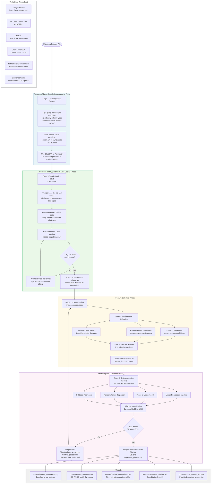
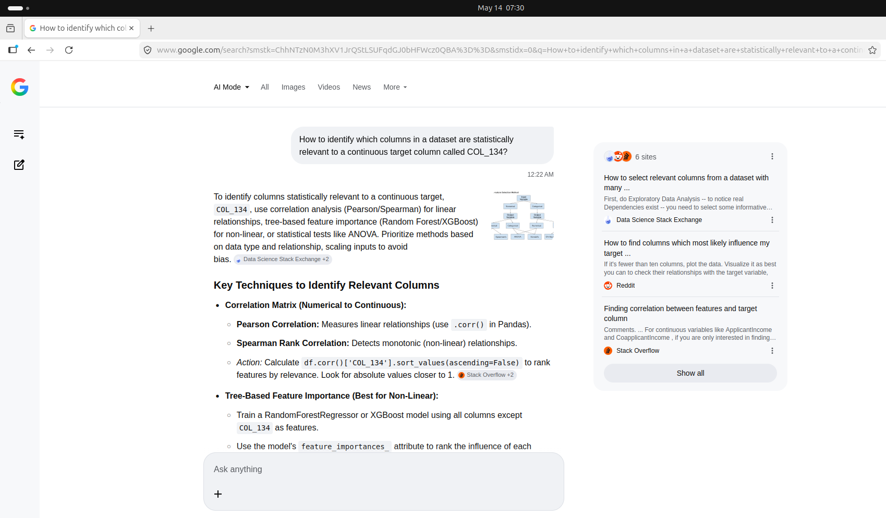
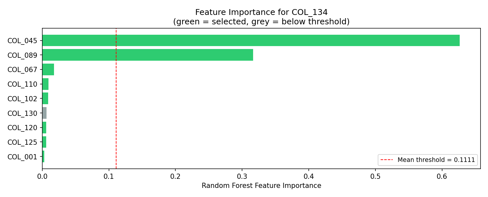
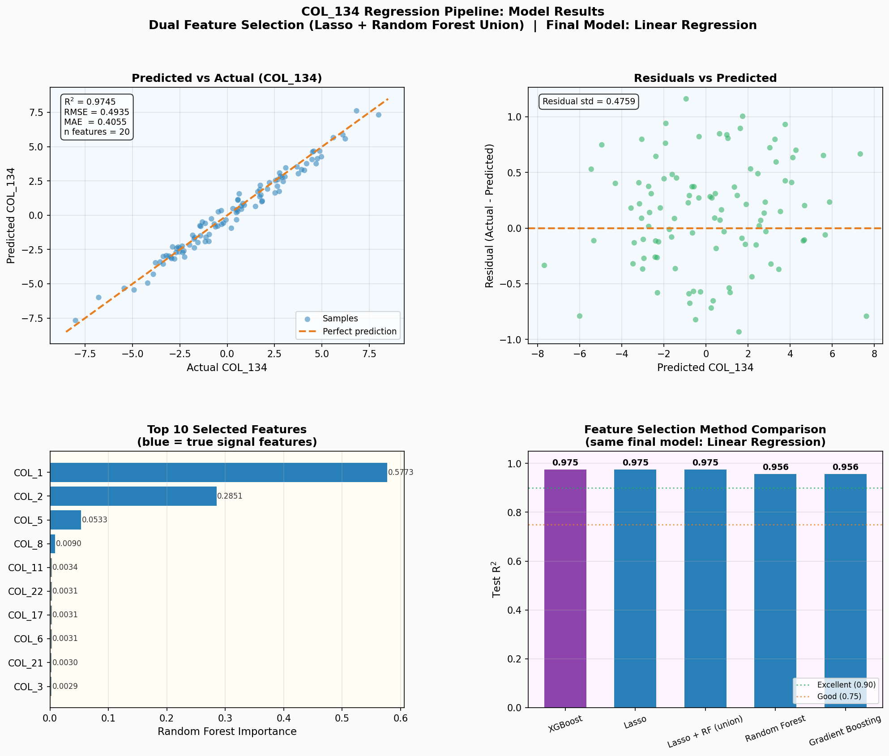

# How to Utilize AI Agents and Vibe Coding to Solve Machine Learning Problems?

## Table of Contents

1. [Overview](#overview)
2. [Using Google Search to Investigate Unknown Datasets](#using-google-search-to-investigate-unknown-datasets)
   - [How to Use the Google Search Box](#how-to-use-the-google-search-box)
   - [Example Google Search Queries](#example-google-search-queries)
   - [Sample Query: Identifying Relevant Columns for COL_134](#sample-query-identifying-relevant-columns-for-col_134)
   - [Steps to Use Google Search Together with VS Code](#steps-to-use-google-search-together-with-vs-code)
3. [Vibe Coding with VS Code and AI Agents](#vibe-coding-with-vs-code-and-ai-agents)
   - [What is Vibe Coding](#what-is-vibe-coding)
   - [Steps to Use Vibe Coding for Unknown Data](#steps-to-use-vibe-coding-for-unknown-data)
   - [Example Prompts for VS Code Copilot Chat](#example-prompts-for-vs-code-copilot-chat)
4. [Using Other AI Tools](#using-other-ai-tools)
5. [Virtual Environment Setup](#virtual-environment-setup)
   - [Creating the Virtual Environment](#creating-the-virtual-environment)
   - [Installing Machine Learning Libraries](#installing-machine-learning-libraries)
6. [Project Structure](#project-structure)
7. [Feature Selection](#feature-selection)
8. [Regression Models](#regression-models)
9. [Use Case: Modeling COL_134 as a Regression Problem](#use-case-modeling-col_134-as-a-regression-problem)
   - [Problem Description](#problem-description)
   - [Solution Approach](#solution-approach)
   - [Prompts for Creating an Algorithm](#prompts-for-creating-an-algorithm)
10. [The Feature Selection and Regression Pipeline](#the-feature-selection-and-regression-pipeline)
    - [How the Pipeline Works](#how-the-pipeline-works)
    - [Complete Pipeline Script](#complete-pipeline-script)
    - [Generating the Demo Dataset](#generating-the-demo-dataset)
    - [Running the Script](#running-the-script)
    - [Feature Importance Chart](#feature-importance-chart)
    - [Script Output Visualization](#script-output-visualization)
    - [Scatter Plots and Pairplots for Top Features](#scatter-plots-and-pairplots-for-top-features)
11. [Feature Selection with XGBoost](#feature-selection-with-xgboost)
12. [Evaluating and Comparing Feature Selection Algorithms](#evaluating-and-comparing-feature-selection-algorithms)
    - [Comparison of Five Feature Selection Methods](#comparison-of-five-feature-selection-methods)
    - [Comparison Script](#comparison-script)
    - [Reading the Results Table](#reading-the-results-table)
    - [Decision Rules for Selecting a Method](#decision-rules-for-selecting-a-method)
    - [Summary Recommendation for COL_134](#summary-recommendation-for-col_134)
13. [Using Ollama for Feature Selection and Regression](#using-ollama-for-feature-selection-and-regression)
    - [Role of Ollama in the Machine Learning Pipeline](#role-of-ollama-in-the-machine-learning-pipeline)
    - [Pipeline Workflow Overview](#pipeline-workflow-overview)
    - [Semantic Feature Review with Ollama](#semantic-feature-review-with-ollama)
    - [Ollama-Guided Feature Engineering](#ollama-guided-feature-engineering)
    - [Numerical Feature Selection and Regression](#numerical-feature-selection-and-regression)
    - [Ollama for Result Interpretation](#ollama-for-result-interpretation)
    - [Recommended Open-Source Models](#recommended-open-source-models)
    - [Python Integration Examples](#python-integration-examples)
14. [Testing the Environment](#testing-the-environment)
    - [Testing Python and Libraries](#testing-python-and-libraries)
    - [Installing and Testing Ollama](#installing-and-testing-ollama)
    - [Installing and Testing Docker](#installing-and-testing-docker)
    - [VS Code Integration](#vs-code-integration)
15. [References](#references)

---

## Overview

This tutorial explains how to solve machine learning problems when working with an unknown dataset. It covers how to use open source tools such as Google Search, AI agent chat interfaces, and VS Code with Copilot to discover the structure of unknown data, identify the type of machine learning problem, and build a solution using Feature Selection and Regression techniques.

The primary use case is a dataset containing a continuous variable (COL_134) that represents a physical characteristic of an elevator component. The goal is to model this variable as a function of other relevant variables found in the same file, where neither the relevant variables nor the structure of the dataset are known in advance.

This document is intended for practitioners who encounter datasets with no accompanying documentation and need a systematic, tool-assisted workflow to go from raw unknown data to a working machine learning model.

### Workflow Overview Diagram

The diagram below illustrates the full flow of information, tools, queries, and decisions involved in solving an unknown dataset problem with AI agents and machine learning.



---

## Using Google Search to Investigate Unknown Datasets

### How to Use the Google Search Box

When working with an unknown dataset, the first practical step is to use Google Search to gather information about the file format, column naming conventions, domain knowledge, and suitable machine learning approaches. The Google homepage at https://www.google.com provides a search box (also called a search field) where you type your query. This input field accepts natural language questions as well as technical keyword combinations.

To use Google Search, open a web browser and navigate to https://www.google.com. Type your query into the search box at the center of the page and press Enter or click the search icon. Google returns a list of relevant web pages, official documentation, articles, and forum discussions that match your query.

When investigating an unknown dataset, write search queries that include specific details about the file extension, any column names you can identify, or the domain from which the data is likely to originate. Adding terms such as "python", "pandas", "scikit-learn", or "machine learning" alongside your data-related terms will return more targeted and practical results.

Effective search queries follow a structure such as:

```
[what you want to do] [tool or language] [domain or context]
```

For example: `identify column data types unknown dataset pandas python` or `feature selection continuous target variable regression scikit-learn`.

### Example Google Search Queries

The following queries are designed to be typed into the Google search box to investigate an unknown dataset and determine how to approach it as a machine learning problem.

**Identifying the file type and format:**

```
how to read unknown file format machine learning python
identify CSV vs JSON vs Excel file programmatically pandas python
python detect file type from content without extension
python pandas read unknown file type automatically
```

**Understanding column types and data structure:**

```
how to identify column data types in dataset pandas python
python infer data types columns unknown dataset
pandas df.info df.dtypes column type detection tutorial
how to check if column is categorical or continuous python pandas
check mixed data types in pandas column python
```

**Determining the machine learning problem type:**

```
how to determine regression vs classification problem from dataset
continuous target variable regression machine learning python
how to identify target variable in unknown dataset
machine learning problem type from data distribution python
determine supervised learning problem type from column values
```

**Finding relevant features for a continuous target variable:**

```
feature selection continuous target variable regression python
find relevant columns for target variable python correlation
feature importance regression scikit-learn python
pearson correlation feature selection continuous variable
mutual information feature selection regression scikit-learn
```

**Selecting algorithms for unknown data:**

```
best regression algorithm unknown dataset python scikit-learn
compare regression algorithms python cross-validation
random forest regression vs gradient boosting unknown features
automated machine learning unknown dataset python
which regression model to use first unknown dataset
```

**Elevator component and industrial sensor data context:**

```
elevator component sensor data machine learning regression
predictive maintenance continuous variable regression scikit-learn
industrial sensor dataset feature selection python
mechanical component property regression prediction python
```

### Sample Query: Identifying Relevant Columns for COL_134

The query below is an example of how to start a Google Search or AI chat agent session when the goal is to find which columns in an unknown dataset are statistically relevant to a continuous target variable.

**Search query typed into Google or an AI chat agent:**

```
How to identify which columns in a dataset are statistically relevant to a continuous target column called COL_134?
```

**Google AI Mode result for this query:**



**Extracted response text from the search result:**

To identify columns statistically relevant to a continuous target, `COL_134`, use correlation analysis (Pearson/Spearman) for linear relationships, tree-based feature importance (Random Forest/XGBoost) for non-linear, or statistical tests like ANOVA. Prioritize methods based on data type and relationship, scaling inputs to avoid bias.

**Key Techniques to Identify Relevant Columns**

**Correlation Matrix (Numerical to Continuous):**

- **Pearson Correlation:** Measures linear relationships. Use `.corr()` in Pandas.
- **Spearman Rank Correlation:** Detects monotonic (non-linear) relationships.
- *Action:* Calculate `df.corr()['COL_134'].sort_values(ascending=False)` to rank features by relevance. Look for absolute values closer to 1.

**Tree-Based Feature Importance (Best for Non-Linear):**

- Train a `RandomForestRegressor` or XGBoost model using all columns except `COL_134` as features.
- Use the model's `feature_importances_` attribute to rank the influence of each column on `COL_134`.

**Statistical Tests (Categorical to Continuous):**

- Use ANOVA (Analysis of Variance) to test if different categories in a categorical column yield different means for `COL_134`.

**Workflow for Selection**

1. **Clean Data:** Remove or handle missing values and scale numerical data using `RobustScaler` if outliers are present.
2. **Run Correlation:** Quickly identify linear drivers.
3. **Calculate Feature Importance:** Identify complex, non-linear drivers.
4. **Visualize:** Create scatter plots or pairplots to confirm relationships for top-ranked features.
5. **Remove Multicollinearity:** Ensure selected features are not highly correlated with each other using a correlation matrix to keep only independent predictors.

### Steps to Use Google Search Together with VS Code

The most effective workflow combines Google Search for background research and VS Code with Copilot for implementation. Follow these steps to move from an unknown dataset to a working solution:

**Step 1.** Open the Google homepage and type a query about the unknown dataset in the search box. Start with broad queries about file format identification, then narrow down to column type detection.

**Step 2.** Read the top search results, focusing on Stack Overflow answers, official pandas or scikit-learn documentation, and Towards Data Science articles. Note the function names, method names, and code patterns mentioned.

**Step 3.** Open VS Code and the Copilot chat panel. Paste any relevant function names or concepts from your research into the chat as context before asking the agent to write code.

**Step 4.** Ask the Copilot agent to generate Python code based on what you found in Google Search. For example, if Google told you to use `df.info()` and `df.describe()`, instruct the agent to write a script that calls both functions and formats the output clearly.

**Step 5.** Run the generated code in the VS Code terminal and share the printed output back with the Copilot agent in the chat. Ask the agent to interpret the results and suggest the next step.

**Step 6.** Use follow-up Google searches to clarify any ambiguous terminology that appears in the output. For instance, if the dataset contains columns with unexpected dtype values, search for what that dtype means and how to handle it.

**Step 7.** Return to the VS Code Copilot chat and provide the agent with the clarification from your search. Instruct the agent to proceed with the approach informed by your research.

**Step 8.** Repeat the cycle of searching, reading, and prompting until the problem is fully understood and the solution is implemented.

---

## Vibe Coding with VS Code and AI Agents

### What is Vibe Coding

Vibe coding is an approach to software development where you use high-level natural language prompts to direct an AI agent to write, execute, and iterate on code. Instead of specifying every line of logic, you describe the goal and let the AI generate the implementation. You then review the output, identify issues, and provide refined instructions. This iterative loop between human intent and AI code generation is particularly effective for exploratory tasks such as investigating unknown datasets.

VS Code provides a built-in chat interface (Copilot Chat) where you can communicate with an AI agent such as Claude or GitHub Copilot. The agent can read files in your workspace, generate Python scripts, and suggest machine learning approaches based on the data it observes. To open the chat panel in VS Code, press Ctrl+Shift+I or open it from the View menu under Chat.

The vibe coding approach for unknown datasets relies on the following principles:

- State the objective at a high level without specifying the exact implementation.
- Let the AI generate and execute code to examine the data structure, column types, and file format.
- Verify each result manually by reading the printed output before proceeding to the next step.
- When the AI encounters ambiguous or unknown properties, instruct it to report the ambiguity rather than guess.
- Iterate progressively from data discovery to feature selection to model training.

### Steps to Use Vibe Coding for Unknown Data

**Step 1. Initialize with a Vibe Prompt**

Open VS Code and place the unknown dataset file in the workspace folder. Start a new chat session with the Copilot agent and give it a high-level instruction to explore the data without making any assumptions about its structure or content.

Example prompt:
```
Load the file in this workspace and analyze its structure to determine column names,
data types, and the number of rows. Suggest whether this dataset describes a regression
or classification problem based on the distribution of values. Do not guess file format;
detect it from the extension and content.
```

**Step 2. Iterate on Data Discovery**

After the agent generates the initial exploration code, run the code in the VS Code terminal and paste the output back into the chat. Ask the agent to interpret the findings and proceed to the next step.

Example prompt:
```
Here is the output of df.info() and df.describe() for the loaded dataset.
Some columns contain string values. Identify which columns are categorical
and which columns are numeric. List columns that contain missing values.
Do not convert any data types yet.
```

**Step 3. Identify the File Type and Format**

The agent will identify the file type based on the extension and content patterns. If the file type is ambiguous, instruct the agent to attempt multiple read methods and confirm which one succeeds before proceeding.

Example prompt:
```
The file extension is not clearly recognized. Write Python code that attempts to read
the file as CSV first, then as JSON, then as Excel. Report which format succeeds
and display the first five rows of the resulting dataframe.
```

**Step 4. Select an Algorithm Based on Data Structure**

Once the columns and their types are confirmed, ask the agent to recommend a machine learning algorithm. Provide the target column name and ask for a comparison of candidate algorithms using cross-validation so that the choice is data-driven rather than arbitrary.

Example prompt:
```
Based on the target column COL_134 and the data types of the other columns,
propose three regression algorithms suitable for this dataset. For each algorithm,
explain its assumptions and its strengths in the context of this data. Then implement
5-fold cross-validation for each and compare RMSE and R-squared scores.
```

**Step 5. Refine and Solve**

Continue giving high-level instructions to handle missing values, outliers, feature engineering, and model evaluation. Manually verify each intermediate output using `df.head()` or printed summaries before instructing the agent to proceed to the next stage. This prevents errors from propagating through the pipeline undetected.

**Prompting Guidelines for Vibe Coding:**

State the plan at the beginning of each prompt using a brief sentence that defines the objective for that step.

Use iterative validation by manually reviewing `df.head()` and summary statistics after each code generation step to confirm the agent interpreted the data structure correctly.

Handle unknowns explicitly by telling the AI not to guess when uncertain. Instruct it to mark ambiguous types as "unknown" and exclude them temporarily to prevent errors from cascading through the pipeline.

### Example Prompts for VS Code Copilot Chat

The following prompts are designed to be typed or pasted into the VS Code Copilot chat window. They follow the vibe coding principle of high-level goal specification combined with explicit instructions about how to handle uncertainty.

**Exploring an unknown dataset:**
```
Load the dataset file in the current workspace and analyze its structure.
Determine the column names, the data type of each column, the total number of rows,
and whether any columns contain missing or null values.
Do not guess the file format; detect it from the file extension and the first few bytes
of content. Report all findings before writing any machine learning code.
```

**Identifying the file type:**
```
The file extension is ambiguous. Write Python code that attempts to read the file
as CSV, then as JSON, then as a tab-separated file, and then as Excel.
Report which format reads successfully and display the first five rows.
Use pandas for all read operations.
```

**Checking column types:**
```
For the loaded dataframe, identify which columns are numeric continuous,
which are numeric discrete (integers with few unique values), and which are
categorical or string type. Do not convert any types yet. Report the data type
classification for every column and note any columns with mixed or ambiguous types.
```

**Finding relevant columns for a target variable:**
```
The target column is COL_134. It contains continuous numeric values.
Calculate the Pearson correlation between COL_134 and every other numeric column.
List the top 20 columns with the highest absolute correlation values.
Also calculate Spearman correlation for comparison. Explain what the difference
between the two correlation lists suggests about the nature of the relationships.
```

**Selecting a machine learning algorithm:**
```
Based on the target column COL_134 being a continuous variable and the data types
of the predictor columns identified so far, propose three regression algorithms
suitable for this dataset. For each algorithm, describe its assumptions, strengths,
and limitations for this type of data. Then implement cross-validation for all three
algorithms and report RMSE and R-squared scores on the validation folds.
```

**Building a regression pipeline:**
```
Create a scikit-learn Pipeline that includes the following preprocessing steps:
impute missing numeric values using the median strategy, scale numeric features
using StandardScaler. Add the best performing regression model from the previous
evaluation as the final step. Use the top 15 features identified by correlation analysis
as input. Split the data 80 percent for training and 20 percent for testing.
Report the final RMSE and R-squared on the test set.
```

**Handling unknown column types:**
```
Some columns in the dataset have ambiguous or mixed content that cannot be
classified as purely numeric or categorical. For each such column, mark it
with the label unknown_type and exclude it from the current pipeline.
Print a list of all excluded columns with the reason for exclusion.
Do not attempt to guess the correct type or convert ambiguous columns without
explicit confirmation from the user.
```

**Asking the agent to create a script for an unknown dataset:**
```
Write a Python script called explore_dataset.py that accepts a file path as a
command line argument. The script should detect the file format automatically,
load the data, print the shape, column names, data types, and missing value counts,
then classify each column as continuous numeric, discrete numeric, categorical, or
unknown. Save the output to a text file called dataset_report.txt.
```

---

## Using Other AI Tools

In addition to VS Code Copilot Chat, other AI tools can help you compose effective queries, interpret results, and develop solutions for unknown dataset problems.

### ChatGPT

ChatGPT at https://chat.openai.com is useful for composing initial queries before bringing them into VS Code. It is well suited for generating search query ideas, explaining machine learning concepts, and drafting Python code templates when you are not yet sure how to frame your problem for a coding agent.

Example queries for ChatGPT:

```
I have a dataset with an unknown file format and column names I do not understand.
What Python code should I run first to identify the file type, column names,
and data types? Suggest a sequence of pandas commands in the order I should use them.
```

```
I have a continuous numeric target variable called COL_134 in a dataset.
The other columns may or may not be relevant to predicting it.
What are the best feature selection techniques for regression problems when I do
not know in advance which columns are relevant? Give me Python examples using
scikit-learn and pandas.
```

```
Write a prompt I can paste into VS Code Copilot Chat to ask an AI agent to
explore an unknown CSV file, detect its schema, identify a target variable,
and recommend a machine learning algorithm based on the column types it finds.
```

**Using ChatGPT to Compose VS Code Prompts**

ChatGPT is particularly effective for refining the language of prompts before sending them to VS Code Copilot. You can describe your problem to ChatGPT in plain conversational language and ask it to rewrite your description as a precise, well-structured prompt for a coding agent. This two-step approach often produces better results than composing the prompt directly.

For example, describe the problem to ChatGPT: "I have a file with columns I do not understand and I want to use Python to figure out which columns are most relevant for predicting COL_134." Then ask ChatGPT to "rewrite this as a VS Code Copilot prompt for a machine learning agent." Paste the resulting prompt into the VS Code Copilot chat.

### Perplexity AI

Perplexity AI at https://www.perplexity.ai is suited for research-oriented questions about datasets and machine learning methods because it provides cited sources alongside its answers. This makes it easier to trace the origin of suggestions and verify that the recommended approach is grounded in reliable documentation rather than generated assumptions.

### Google Gemini

Google Gemini at https://gemini.google.com can analyze descriptions of dataset problems and suggest Python-based approaches. It integrates with Google's search index, which can make its answers more current than models trained on static datasets.

### Claude

Claude at https://claude.ai can be used independently for detailed code generation and step-by-step explanations when working outside of VS Code. It handles long technical documents and structured reasoning tasks well, making it suitable for analyzing dataset reports and planning multi-step machine learning workflows.

---

## Virtual Environment Setup

### Creating the Virtual Environment

A virtual environment isolates the Python dependencies for this project from other Python projects on your system. It is required before installing any machine learning libraries, and it must be activated each time you open a new terminal session to work on this project.

Follow these steps on a Linux terminal.

**Step 1. Verify that Python 3 is installed:**
```bash
python3 --version
```

The output should show Python 3.8 or later. If Python is not installed, install it with:
```bash
sudo apt update && sudo apt install python3 python3-pip python3-venv
```

**Step 2. Navigate to the project folder:**
```bash
cd "Feature Selection"
```

**Step 3. Create the virtual environment:**
```bash
python3 -m venv venv
```

This creates a folder named `venv` inside the current directory. This folder contains a standalone Python interpreter and a local `site-packages` directory for installed packages.

**Step 4. Activate the virtual environment:**
```bash
source venv/bin/activate
```

After activation, your terminal prompt will show `(venv)` at the beginning of each line. You must activate the virtual environment before running any Python scripts or installing packages for this project. Commands run without activation will use the system Python and will not have access to the project libraries.

**Step 5. Verify the activation was successful:**
```bash
which python
```

The output should show a path ending in `venv/bin/python` inside the project folder.

**Step 6. Upgrade pip to the latest version before installing packages:**
```bash
pip install --upgrade pip
```

**Step 7. Deactivate the virtual environment when you have finished working:**
```bash
deactivate
```

### Installing Machine Learning Libraries

After activating the virtual environment, install the required libraries using pip. These libraries provide the tools needed for data loading, feature selection, regression modeling, and evaluation.

**Install core machine learning and data science libraries:**
```bash
pip install numpy pandas scikit-learn matplotlib seaborn
```

**Install additional libraries for advanced regression and feature selection:**
```bash
pip install scipy statsmodels xgboost lightgbm
```

**Install Jupyter for interactive exploration:**
```bash
pip install jupyterlab notebook ipykernel
```

**Register the virtual environment as a Jupyter kernel so it appears in VS Code notebooks:**
```bash
python -m ipykernel install --user --name=feature-selection-env --display-name "Feature Selection (venv)"
```

**Save the installed packages to a requirements file for reproducibility:**
```bash
pip freeze > requirements.txt
```

**Restore the environment from the requirements file on another machine or after recreating the environment:**
```bash
pip install -r requirements.txt
```

**Summary of Required Libraries:**

| Library | Purpose |
|---|---|
| numpy | Numerical computation and array operations |
| pandas | Data loading, inspection, and manipulation |
| scikit-learn | Feature selection, regression, and model evaluation |
| matplotlib | Visualization of data distributions and model results |
| seaborn | Statistical data visualization with a high-level interface |
| scipy | Statistical tests for evaluating feature relevance |
| statsmodels | Statistical modeling, regression diagnostics, and inference |
| xgboost | Gradient boosted regression trees with built-in regularization |
| lightgbm | Fast gradient boosted regression for large datasets |
| jupyterlab | Interactive notebook environment for exploration |

---

## Project Structure

```
Feature Selection/
◈ README.md                        Project documentation and guide
◈ .gitignore                       Git ignore rules
▸ venv/                            Virtual environment (excluded from Git)
▸ scripts/                         Python scripts for automated pipeline
  ▪ generate_dataset.py            Generates the synthetic elevator_data.csv demo dataset
  ▪ col134_feature_selection.py    Five-stage pipeline: type detection, preprocessing,
  |                                Lasso + RF dual selection, Linear Regression, output chart
  ▪ generate_results_plot.py       Generates the four-panel pipeline result summary plot
  ▪ elevator_data.csv              Synthetic elevator component demo dataset (500 rows, 12 columns)
▸ outputs/                         Generated figures (created on first run)
  ▪ feature_importance.png         Random Forest feature importance bar chart
  |                                (green = selected, grey = below mean threshold)
  ▪ col134_results_plot.png        Four-panel pipeline result summary plot
  ▪ screenshot.png                 Google AI Mode search result screenshot
```

---

## Feature Selection

Feature selection is the process of identifying the subset of input variables that are most relevant to predicting the target variable. In this project, the goal is to identify which columns in the dataset are the most reliable predictors of the continuous variable COL_134.

### Why Feature Selection Matters

When working with an unknown dataset, the total number of columns may be large and their meanings may not be documented. Not all columns contribute useful information to the model. Some columns may be redundant because they are highly correlated with each other. Some columns may contain random noise that has no systematic relationship to the target. Some columns may have data quality issues such as high proportions of missing values or inconsistent encoding.

Including irrelevant or redundant features in a regression model can degrade prediction accuracy, increase training time, and make the model harder to interpret. Feature selection reduces these risks by narrowing the input space to the most informative variables before model training begins.

### Feature Selection Methods for Regression

**Filter Methods**

Filter methods evaluate each feature independently of the model using statistical measures. They are computationally inexpensive and work well as a first pass over an unknown dataset.

- Pearson Correlation Coefficient measures the linear relationship between a numeric feature and the numeric target variable. Features with high absolute correlation values are strong linear predictors.
- Spearman Rank Correlation is a non-parametric alternative that captures monotonic relationships, including non-linear ones where the ranking of values follows a consistent pattern.
- Mutual Information measures the statistical dependency between a feature and the target without assuming any particular functional form, making it effective for non-linear relationships.
- F-statistic for regression tests whether the linear relationship between a feature and the target is statistically significant given the sample size.

**Wrapper Methods**

Wrapper methods evaluate feature subsets by training a model on different subsets and measuring the change in predictive performance. They are more computationally expensive than filter methods but account for interactions between features.

- Recursive Feature Elimination trains the model, removes the feature with the lowest importance score, and repeats until the desired number of features remains.
- Sequential Feature Selection adds or removes features one at a time based on cross-validated model performance, stopping when adding or removing a feature no longer improves the score.

**Embedded Methods**

Embedded methods perform feature selection as part of the model training process itself.

- Lasso Regression (L1 Regularization) shrinks the coefficients of irrelevant features exactly to zero during training, effectively removing them from the model and serving as both a regression model and a feature selector.
- Ridge Regression (L2 Regularization) shrinks all coefficients but retains all features. The relative magnitude of the coefficients indicates the relative importance of features.
- Tree-based Feature Importance uses Random Forest and Gradient Boosting models which assign importance scores to each feature based on how much each feature reduces prediction error across all decision trees in the ensemble.

### Applying Feature Selection with scikit-learn

```python
import pandas as pd
from sklearn.feature_selection import SelectKBest, f_regression, mutual_info_regression
from sklearn.feature_selection import RFE
from sklearn.linear_model import Lasso
from sklearn.ensemble import RandomForestRegressor

# Load data
df = pd.read_csv("data/dataset.csv")

# Define target and features
target = "COL_134"
X = df.drop(columns=[target])
y = df[target]

# Filter method: F-statistic
selector_f = SelectKBest(score_func=f_regression, k=15)
selector_f.fit(X, y)
selected_f = X.columns[selector_f.get_support()]
print("Top features by F-statistic:", list(selected_f))

# Filter method: Mutual information
selector_mi = SelectKBest(score_func=mutual_info_regression, k=15)
selector_mi.fit(X, y)
selected_mi = X.columns[selector_mi.get_support()]
print("Top features by mutual information:", list(selected_mi))

# Embedded method: Lasso
lasso = Lasso(alpha=0.01)
lasso.fit(X, y)
lasso_features = X.columns[lasso.coef_ != 0]
print("Features selected by Lasso:", list(lasso_features))

# Embedded method: Random Forest importance
rf = RandomForestRegressor(n_estimators=100, random_state=42)
rf.fit(X, y)
importances = pd.Series(rf.feature_importances_, index=X.columns)
top_rf = importances.nlargest(15)
print("Top features by Random Forest importance:")
print(top_rf)
```

---

## Regression Models

Regression is a type of supervised machine learning where the goal is to predict a continuous numeric output variable based on one or more input features. In this project, the target variable is COL_134, which represents a continuous physical characteristic of an elevator component. The model learns a mapping from the predictor columns to COL_134 by fitting the relationship observed in the training data.

### Types of Regression Models

**Linear Regression**

Linear regression fits a linear relationship between the input features and the target variable. It is the simplest regression model and serves as a useful baseline. It is interpretable and computationally efficient, but it assumes a linear relationship and is sensitive to outliers and multicollinearity.

```python
from sklearn.linear_model import LinearRegression
model = LinearRegression()
```

**Ridge Regression**

Ridge regression adds L2 regularization to linear regression, which penalizes large coefficient values. It reduces overfitting when many correlated features are present and is a good starting point for datasets with many columns where multicollinearity is suspected.

```python
from sklearn.linear_model import Ridge
model = Ridge(alpha=1.0)
```

**Lasso Regression**

Lasso regression uses L1 regularization, which drives some feature coefficients exactly to zero during training. This makes Lasso both a regression model and an automatic feature selector. It is useful when only a small subset of the available features is expected to be truly relevant.

```python
from sklearn.linear_model import Lasso
model = Lasso(alpha=0.01)
```

**ElasticNet Regression**

ElasticNet combines L1 and L2 regularization by mixing both penalties. It is useful when there are many features, some of which are correlated with each other, because it performs both selection (L1) and coefficient shrinkage (L2) simultaneously.

```python
from sklearn.linear_model import ElasticNet
model = ElasticNet(alpha=0.1, l1_ratio=0.5)
```

**Random Forest Regressor**

Random Forest builds an ensemble of decision trees and averages their predictions. It handles non-linear relationships and interactions between features naturally, is robust to outliers, and provides feature importance scores. It does not require feature scaling.

```python
from sklearn.ensemble import RandomForestRegressor
model = RandomForestRegressor(n_estimators=100, random_state=42)
```

**Gradient Boosting Regressor**

Gradient Boosting builds trees sequentially, where each new tree corrects the prediction errors of the previous one. It often achieves higher accuracy than Random Forest on structured tabular data but requires more careful hyperparameter tuning to avoid overfitting.

```python
from sklearn.ensemble import GradientBoostingRegressor
model = GradientBoostingRegressor(n_estimators=100, learning_rate=0.1, random_state=42)
```

**XGBoost Regressor**

XGBoost is an optimized implementation of gradient boosting that is faster and more memory-efficient than the scikit-learn implementation. It includes built-in regularization, handles missing values automatically, and is a strong general-purpose choice for unknown tabular datasets.

```python
from xgboost import XGBRegressor
model = XGBRegressor(n_estimators=100, learning_rate=0.1, random_state=42)
```

### Evaluating Regression Models

The following metrics are standard for evaluating the performance of regression models. They should be computed on a held-out test set or via cross-validation to reflect generalization performance rather than training fit.

| Metric | Description |
|---|---|
| Mean Absolute Error (MAE) | Average absolute difference between predicted and actual values |
| Mean Squared Error (MSE) | Average squared difference; penalizes larger errors more heavily than MAE |
| Root Mean Squared Error (RMSE) | Square root of MSE; expressed in the same unit as the target variable |
| R-squared (R2) | Proportion of variance in the target explained by the model; 1.0 is a perfect fit |

```python
from sklearn.model_selection import train_test_split, cross_val_score
from sklearn.metrics import mean_absolute_error, mean_squared_error, r2_score
import numpy as np

X_train, X_test, y_train, y_test = train_test_split(X, y, test_size=0.2, random_state=42)

model.fit(X_train, y_train)
y_pred = model.predict(X_test)

print("MAE:", mean_absolute_error(y_test, y_pred))
print("RMSE:", np.sqrt(mean_squared_error(y_test, y_pred)))
print("R2:", r2_score(y_test, y_pred))
```

### Comparing Multiple Models

```python
from sklearn.model_selection import cross_val_score
from sklearn.linear_model import LinearRegression, Ridge, Lasso
from sklearn.ensemble import RandomForestRegressor, GradientBoostingRegressor
from xgboost import XGBRegressor
import numpy as np

models = {
    "Linear Regression": LinearRegression(),
    "Ridge": Ridge(alpha=1.0),
    "Lasso": Lasso(alpha=0.01),
    "Random Forest": RandomForestRegressor(n_estimators=100, random_state=42),
    "Gradient Boosting": GradientBoostingRegressor(n_estimators=100, random_state=42),
    "XGBoost": XGBRegressor(n_estimators=100, random_state=42),
}

for name, model in models.items():
    scores = cross_val_score(model, X, y, cv=5, scoring="neg_root_mean_squared_error")
    rmse = -scores.mean()
    r2_scores = cross_val_score(model, X, y, cv=5, scoring="r2")
    print(f"{name}: RMSE = {rmse:.4f}, R2 = {r2_scores.mean():.4f}")
```

---

## Use Case: Modeling COL_134 as a Regression Problem

### Problem Description

The dataset used in this project describes a continuous variable that represents a physical characteristic of an elevator component. The problem is defined by the following three statements:

1. The data file describes a continuous variable characteristic of an elevator component, stored in column COL_134.
2. The objective is to model COL_134 as a function of the relevant variables.
3. The relevant variables are assumed to be found in the same file, in other columns of the dataset.

This is a supervised regression problem. The target variable COL_134 is continuous and numeric. The predictor variables are the remaining columns in the dataset. The specific set of relevant predictor columns is not known in advance and must be determined through feature selection.

The unknown aspects of the dataset that must be resolved before modeling begins include the total number of columns, the naming convention used for columns, the data type of each column (continuous numeric, discrete numeric, categorical, or string), whether any columns contain missing values, whether any preprocessing steps such as normalization, encoding, or imputation are required, and whether any columns are derived from or closely related to COL_134 in ways that would introduce data leakage.

### Solution Approach

**Phase 1: Data Discovery**

The first phase resolves all structural unknowns in the dataset. Load the file and examine its properties to answer the following questions:

- What is the file format (CSV, Excel, JSON, or other)?
- How many rows and columns does the dataset contain?
- What are the column names and their data types?
- Does COL_134 contain continuous numeric values as expected?
- Are there missing values in any column and how frequent are they?
- Are there columns with only one unique value (constant columns with no predictive value)?
- Are there columns with a very high proportion of unique values (likely identifiers rather than features)?

**Phase 2: Feature Selection**

Use statistical methods to identify the subset of columns most relevant to predicting COL_134.

- Compute Pearson correlation between each numeric column and COL_134 to identify linear relationships.
- Compute Spearman rank correlation as a non-parametric complement that captures monotonic non-linear relationships.
- Apply mutual information regression to detect any statistical dependency, including non-linear ones.
- Train a Lasso regression model and retain only the features with non-zero coefficients.
- Train a Random Forest Regressor and rank features by their importance scores.

Compare the feature lists from each method. Features that appear in the top results of multiple methods are the most reliable candidates for the final model.

**Phase 3: Model Training and Evaluation**

Train multiple regression models using the selected features and evaluate them using 5-fold cross-validation. Use RMSE and R-squared as the primary comparison metrics. The following models cover a range of complexity from linear to non-linear:

- Linear Regression as a simple interpretable baseline
- Ridge or Lasso Regression for regularized linear modeling
- Random Forest Regressor for non-linear ensemble modeling
- Gradient Boosting or XGBoost for high-performance ensemble modeling

Select the model with the best cross-validated RMSE and deploy it in a scikit-learn Pipeline for reproducibility.

**Phase 4: Interpretation**

After selecting the best model, analyze the results to understand which features are most important for predicting COL_134. Use feature importance scores from tree-based models or the absolute coefficient values from linear models. For more detailed explanations of individual predictions, consider SHAP (SHapley Additive exPlanations) values, which provide a consistent way to attribute each prediction to each input feature.

### Prompts for Creating an Algorithm

The following prompts are designed to be pasted into the VS Code Copilot chat panel to build the full solution step by step. Run the generated code in the VS Code terminal after each step and share the output with the agent before proceeding to the next prompt.

**Prompt 1: Load and explore the dataset**
```
Load the dataset file in this workspace. Detect the file format automatically
by trying CSV first, then Excel, then JSON. Display the shape, all column names,
the data type of each column, and the count of missing values per column.
Identify whether COL_134 is present and confirm it contains continuous numeric values.
Do not preprocess the data; only report the structure.
```

**Prompt 2: Analyze the distribution of COL_134**
```
Plot the distribution of COL_134 using a histogram and a box plot side by side.
Report the mean, median, standard deviation, minimum, maximum, and the 25th and 75th
percentiles. Identify whether the distribution appears approximately normal, skewed,
or contains significant outliers. Save the figure as outputs/col134_distribution.png.
```

**Prompt 3: Perform feature selection for COL_134**
```
Using the loaded dataframe, perform feature selection to identify the columns
most relevant to predicting COL_134. Apply all three of the following methods:
Pearson correlation, Spearman rank correlation, and mutual information regression.
List the top 20 features from each method. Highlight features that appear in
the top results of all three methods as the most reliable candidates.
```

**Prompt 4: Build and evaluate regression models**
```
Using the top features identified for COL_134, train the following regression models:
Linear Regression, Ridge Regression, Random Forest Regressor, and XGBoost Regressor.
Evaluate each model using 5-fold cross-validation on the training data.
Report the mean RMSE and R-squared for each model. Rank the models by RMSE
from best to worst and recommend the top model for further development.
```

**Prompt 5: Create a full regression pipeline**
```
Build a scikit-learn Pipeline for predicting COL_134 using the best performing model
from the previous step. Include these preprocessing steps in the pipeline: impute
missing numeric values using the median strategy, and scale numeric features using
StandardScaler. Use the top features identified in the feature selection step.
Split the full dataset 80 percent for training and 20 percent for testing.
Train the pipeline on the training set and report MAE, RMSE, and R-squared on the
test set. Save the trained pipeline to outputs/regression_pipeline.pkl.
```

**Prompt 6: Generate a feature importance report**
```
For the trained regression model, generate a feature importance report.
If the model is a tree-based model such as Random Forest or XGBoost, use the
built-in feature_importances_ attribute. If the model is linear, use the absolute
values of the model coefficients. Plot the top 15 most important features in a
horizontal bar chart with feature names on the y-axis and importance values on
the x-axis. Save the figure as outputs/feature_importance.png.
```

**Prompt 7: Handle unknown column types in the dataset**
```
Some columns in the dataset may have ambiguous or mixed data types that cannot be
classified reliably as numeric or categorical. For each such column, exclude it from
the pipeline and label it with the reason for exclusion (for example: mixed types,
all null values, constant value, or possible identifier column). Print a summary
table listing the excluded columns and the exclusion reason for each one.
Do not attempt to convert or guess the type of ambiguous columns.
```

**Prompt 8: Create a complete standalone analysis script**
```
Write a complete Python script called scripts/regression_pipeline.py that performs
the following steps in sequence: load the dataset automatically detecting the file
format, drop excluded columns identified in the previous step, impute and scale
numeric features, perform feature selection using Pearson correlation to select the
top 15 features, train an XGBoost regressor with 5-fold cross-validation, report
RMSE and R-squared on the test set, plot and save feature importance, and save the
trained pipeline to outputs/regression_pipeline.pkl. The script should be runnable
from the command line with the dataset file path as the first argument.
```

---

## The Feature Selection and Regression Pipeline

This section describes the complete algorithm used to identify the relevant columns for COL_134 and build a regression model. The pipeline operates in five sequential stages and handles an unknown number of columns, unknown column types, and missing values automatically. It works regardless of the initial column count and does not require any prior knowledge of the dataset structure.

### How the Pipeline Works

**Stage 1: Type Detection**

Pandas inspects every column and classifies it into one of four categories: numeric continuous (float columns), numeric discrete (integer columns with fewer than 20 unique values), categorical (string or object columns), or datetime. The pipeline confirms that COL_134 is present and contains continuous numeric values before proceeding. If COL_134 is not found or contains non-numeric values, the pipeline stops and reports the error. A column type report is saved to `outputs/column_type_report.txt`.

**Stage 2: Preprocessing**

Numeric columns receive median imputation for missing values followed by StandardScaler normalization. Categorical columns are encoded using one-hot encoding with `pd.get_dummies`. Datetime columns are decomposed into year, month, and day-of-year integer features. Constant columns (zero variance) and near-duplicate columns (Pearson correlation above 0.99) are removed before feature selection begins. This stage handles any column layout automatically.

**Stage 3: Dual Feature Selection**

Two independent feature selection methods are applied in parallel to capture both linear and non-linear predictors.

Lasso regression with L1 regularization shrinks coefficients of irrelevant linear predictors exactly to zero. Only features with non-zero Lasso coefficients are retained from this method.

Random Forest regression ranks all columns by mean decrease in impurity. Features with importance above the mean threshold across all trees are retained from this method.

The union of both selected sets is used as the final feature subset. A feature needs to be selected by at least one method to survive, which captures predictors with strong linear relationships (detected by Lasso) alongside predictors with non-linear relationships with COL_134 (detected by Random Forest).

**Stage 4: Regression Model Training**

A Linear Regression model is trained on the reduced feature set produced by Stage 3. Training on the selected subset rather than all columns reduces overfitting caused by irrelevant noise features. The model is evaluated on a held-out 20 percent test split using R-squared and RMSE as the primary metrics.

**Stage 5: Output**

The pipeline outputs a ranked list of relevant columns with their importance scores and saves a feature importance chart to `feature_importance.png` in the current working directory. Move the chart to `outputs/feature_importance.png` to keep the project folder organised.

### Complete Pipeline Script

The file `scripts/col134_feature_selection.py` already exists in the project. Run it from the project root with the virtual environment activated. Activate the virtual environment first:

```bash
source venv/bin/activate
```

```python
"""
col134_feature_selection.py

Feature selection and regression pipeline for an unknown dataset.
Target column: COL_134 (continuous numeric variable).

Usage:
    python col134_feature_selection.py
    python col134_feature_selection.py --csv your_file.csv --target COL_134
    python col134_feature_selection.py --lasso-alpha 0.05 --rf-trees 500

Requires (install inside virtual environment first):
    pip install numpy pandas scikit-learn xgboost matplotlib seaborn
"""

import argparse
import os
import sys
import warnings
import json
import pickle

import numpy as np
import pandas as pd
import matplotlib.pyplot as plt

from sklearn.linear_model import Lasso, LinearRegression
from sklearn.ensemble import RandomForestRegressor
from sklearn.feature_selection import SelectFromModel
from sklearn.preprocessing import StandardScaler
from sklearn.impute import SimpleImputer
from sklearn.model_selection import train_test_split, cross_val_score
from sklearn.metrics import mean_squared_error, r2_score, mean_absolute_error

warnings.filterwarnings("ignore")

# ---------------------------------------------------------------------------
# CLI arguments
# ---------------------------------------------------------------------------
parser = argparse.ArgumentParser(description="Feature selection and regression for COL_134")
parser.add_argument("--csv",         default=None,  help="Path to dataset file (CSV, Excel, or JSON)")
parser.add_argument("--target",      default="COL_134", help="Name of the target column")
parser.add_argument("--lasso-alpha", type=float, default=0.01, help="Lasso regularisation alpha")
parser.add_argument("--rf-trees",    type=int,   default=200,  help="Number of trees in Random Forest")
parser.add_argument("--test-size",   type=float, default=0.20, help="Test split fraction")
parser.add_argument("--seed",        type=int,   default=42,   help="Random seed")
args = parser.parse_args()

TARGET  = args.target
SEED    = args.seed
OUT_DIR = "outputs"
os.makedirs(OUT_DIR, exist_ok=True)

# ---------------------------------------------------------------------------
# Stage 0: Generate demo dataset if no file is provided
# ---------------------------------------------------------------------------
def make_demo_dataset(n_rows: int = 500, n_cols: int = 30, seed: int = 42) -> pd.DataFrame:
    """Create a synthetic dataset that mimics an unknown elevator sensor file."""
    rng = np.random.default_rng(seed)
    cols = {f"COL_{i}": rng.normal(size=n_rows) for i in range(1, n_cols + 1)}
    df = pd.DataFrame(cols)
    df["COL_134"] = (
        2.5 * df["COL_1"]
        - 1.8 * df["COL_2"]
        + 0.9 * df["COL_5"]
        + rng.normal(scale=0.5, size=n_rows)
    )
    # Categorical column to test mixed-type handling
    df["STATUS"] = rng.choice(["A", "B", "C"], size=n_rows)
    # Introduce some missing values
    for col in ["COL_3", "COL_7"]:
        df.loc[rng.choice(n_rows, size=20, replace=False), col] = np.nan
    return df

# ---------------------------------------------------------------------------
# Stage 1: Load and detect file type
# ---------------------------------------------------------------------------
def load_dataset(path: str) -> pd.DataFrame:
    """Try CSV, Excel, JSON, and TSV in sequence; return the first success."""
    readers = [
        ("CSV",   lambda p: pd.read_csv(p)),
        ("Excel", lambda p: pd.read_excel(p)),
        ("JSON",  lambda p: pd.read_json(p)),
        ("TSV",   lambda p: pd.read_csv(p, sep="\t")),
    ]
    for fmt, reader in readers:
        try:
            df = reader(path)
            print(f"[Stage 1] File loaded as {fmt}. Shape: {df.shape}")
            return df
        except Exception:
            continue
    raise ValueError(f"Could not read '{path}' as CSV, Excel, JSON, or TSV.")

if args.csv:
    df = load_dataset(args.csv)
else:
    print("[Stage 1] No file provided. Generating demo dataset...")
    df = make_demo_dataset(seed=SEED)
    print(f"[Stage 1] Demo dataset shape: {df.shape}")

if TARGET not in df.columns:
    sys.exit(f"Error: target column '{TARGET}' not found. Available columns: {list(df.columns)}")

# ---------------------------------------------------------------------------
# Stage 1b: Column type classification
# ---------------------------------------------------------------------------
def classify_columns(df: pd.DataFrame, target: str) -> dict:
    """Classify every column as numeric_continuous, numeric_discrete,
    categorical, datetime, or unknown."""
    result = {}
    for col in df.columns:
        if col == target:
            result[col] = "target"
            continue
        dtype = df[col].dtype
        if pd.api.types.is_datetime64_any_dtype(dtype):
            result[col] = "datetime"
        elif pd.api.types.is_float_dtype(dtype):
            result[col] = "numeric_continuous"
        elif pd.api.types.is_integer_dtype(dtype):
            result[col] = "numeric_discrete" if df[col].nunique() < 20 else "numeric_continuous"
        elif pd.api.types.is_object_dtype(dtype):
            result[col] = "categorical"
        else:
            result[col] = "unknown"
    return result

col_types = classify_columns(df, TARGET)
type_counts = pd.Series(list(col_types.values())).value_counts()
print("\n[Stage 1] Column type summary:")
print(type_counts.to_string())

report_path = os.path.join(OUT_DIR, "column_type_report.txt")
with open(report_path, "w") as f:
    f.write("Column Type Classification Report\n")
    f.write("=" * 40 + "\n")
    for col, ctype in col_types.items():
        f.write(f"{col:30s}  {ctype}\n")
print(f"[Stage 1] Column type report saved to {report_path}")

# ---------------------------------------------------------------------------
# Stage 2: Preprocessing
# ---------------------------------------------------------------------------
y = df[TARGET].copy()

numeric_cols     = [c for c, t in col_types.items() if t in ("numeric_continuous", "numeric_discrete")]
categorical_cols = [c for c, t in col_types.items() if t == "categorical"]
datetime_cols    = [c for c, t in col_types.items() if t == "datetime"]
unknown_cols     = [c for c, t in col_types.items() if t == "unknown"]

if unknown_cols:
    print(f"[Stage 2] Excluding unknown-type columns: {unknown_cols}")

for col in datetime_cols:
    df[col + "_year"]  = pd.to_datetime(df[col]).dt.year
    df[col + "_month"] = pd.to_datetime(df[col]).dt.month
    df[col + "_doy"]   = pd.to_datetime(df[col]).dt.day_of_year
    numeric_cols.extend([col + "_year", col + "_month", col + "_doy"])

if categorical_cols:
    df = pd.get_dummies(df, columns=categorical_cols, drop_first=True)
    new_cat_cols = [c for c in df.columns
                    if any(c.startswith(cat + "_") for cat in categorical_cols)]
    numeric_cols.extend(new_cat_cols)

X_raw = df[numeric_cols].copy()

imputer = SimpleImputer(strategy="median")
X_imputed = pd.DataFrame(imputer.fit_transform(X_raw), columns=X_raw.columns)

constant_cols = [c for c in X_imputed.columns if X_imputed[c].std() == 0]
if constant_cols:
    print(f"[Stage 2] Removing constant columns: {constant_cols}")
    X_imputed.drop(columns=constant_cols, inplace=True)

corr_matrix = X_imputed.corr().abs()
upper = corr_matrix.where(np.triu(np.ones(corr_matrix.shape), k=1).astype(bool))
duplicate_cols = [c for c in upper.columns if any(upper[c] > 0.99)]
if duplicate_cols:
    print(f"[Stage 2] Removing near-duplicate columns: {duplicate_cols}")
    X_imputed.drop(columns=duplicate_cols, inplace=True)

scaler = StandardScaler()
X_scaled = pd.DataFrame(scaler.fit_transform(X_imputed), columns=X_imputed.columns)
print(f"[Stage 2] Preprocessed feature matrix shape: {X_scaled.shape}")

# ---------------------------------------------------------------------------
# Stage 3: Dual feature selection (Lasso union Random Forest)
# ---------------------------------------------------------------------------
print("\n[Stage 3] Running dual feature selection...")

lasso = Lasso(alpha=args.lasso_alpha, max_iter=10000, random_state=SEED)
lasso.fit(X_scaled, y)
lasso_features = set(X_scaled.columns[lasso.coef_ != 0])
print(f"[Stage 3] Lasso selected {len(lasso_features)} features (alpha={args.lasso_alpha})")

rf = RandomForestRegressor(n_estimators=args.rf_trees, random_state=SEED, n_jobs=-1)
rf.fit(X_scaled, y)
rf_selector  = SelectFromModel(rf, threshold="mean", prefit=True)
rf_features  = set(X_scaled.columns[rf_selector.get_support()])
print(f"[Stage 3] Random Forest selected {len(rf_features)} features (threshold=mean)")

selected_features = sorted(lasso_features | rf_features)
print(f"[Stage 3] Union of selected features: {len(selected_features)} columns")

importances  = pd.Series(rf.feature_importances_, index=X_scaled.columns)
importance_df = pd.DataFrame({
    "feature":       selected_features,
    "rf_importance": [importances[f] for f in selected_features],
    "lasso_coef":    [lasso.coef_[list(X_scaled.columns).index(f)] for f in selected_features],
    "in_lasso":      [f in lasso_features for f in selected_features],
    "in_rf":         [f in rf_features    for f in selected_features],
})
importance_df.sort_values("rf_importance", ascending=False, inplace=True)
importance_df.reset_index(drop=True, inplace=True)
print("\n[Stage 3] Top selected features:")
print(importance_df.to_string(index=False))

importance_csv = os.path.join(OUT_DIR, "feature_importance_table.csv")
importance_df.to_csv(importance_csv, index=False)
print(f"[Stage 3] Importance table saved to {importance_csv}")

fig, ax = plt.subplots(figsize=(10, max(4, len(selected_features) * 0.35)))
colors = ["steelblue" if (b_l and b_r) else "orange"
          for b_l, b_r in zip(importance_df["in_lasso"], importance_df["in_rf"])]
ax.barh(importance_df["feature"], importance_df["rf_importance"], color=colors)
ax.set_xlabel("Random Forest Importance")
ax.set_title(f"Feature Importance for {TARGET}\n"
             "(blue = selected by both Lasso and RF, orange = RF only)")
ax.invert_yaxis()
plt.tight_layout()
chart_path = os.path.join(OUT_DIR, "feature_importance.png")
fig.savefig(chart_path, dpi=120)
plt.close(fig)
print(f"[Stage 3] Feature importance chart saved to {chart_path}")

# ---------------------------------------------------------------------------
# Stage 4: Linear Regression on selected features
# ---------------------------------------------------------------------------
print("\n[Stage 4] Training Linear Regression on selected features...")

X_selected = X_scaled[selected_features]
X_train, X_test, y_train, y_test = train_test_split(
    X_selected, y, test_size=args.test_size, random_state=SEED
)

model = LinearRegression()
model.fit(X_train, y_train)
y_pred = model.predict(X_test)

rmse  = np.sqrt(mean_squared_error(y_test, y_pred))
r2    = r2_score(y_test, y_pred)
mae   = mean_absolute_error(y_test, y_pred)
cv_r2   = cross_val_score(model, X_selected, y, cv=5, scoring="r2")
cv_rmse = -cross_val_score(model, X_selected, y, cv=5,
                            scoring="neg_root_mean_squared_error")

print(f"\n[Stage 4] Test-set results:")
print(f"  R2   = {r2:.4f}")
print(f"  RMSE = {rmse:.4f}")
print(f"  MAE  = {mae:.4f}")
print(f"  CV R2   = {cv_r2.mean():.4f}  (+/- {cv_r2.std():.4f})")
print(f"  CV RMSE = {cv_rmse.mean():.4f} (+/- {cv_rmse.std():.4f})")

# ---------------------------------------------------------------------------
# Stage 5: Save pipeline and results
# ---------------------------------------------------------------------------
pipeline_obj = {
    "imputer":           imputer,
    "scaler":            scaler,
    "selected_features": selected_features,
    "model":             model,
}
pkl_path = os.path.join(OUT_DIR, "regression_pipeline.pkl")
with open(pkl_path, "wb") as f:
    pickle.dump(pipeline_obj, f)
print(f"\n[Stage 5] Pipeline saved to {pkl_path}")

results = {
    "target":              TARGET,
    "n_features_input":    int(X_scaled.shape[1]),
    "n_features_selected": len(selected_features),
    "selected_features":   selected_features,
    "test_r2":             round(r2, 4),
    "test_rmse":           round(rmse, 4),
    "test_mae":            round(mae, 4),
    "cv_r2_mean":          round(float(cv_r2.mean()), 4),
    "cv_rmse_mean":        round(float(cv_rmse.mean()), 4),
}
results_path = os.path.join(OUT_DIR, "results_summary.json")
with open(results_path, "w") as f:
    json.dump(results, f, indent=2)
print(f"[Stage 5] Results summary saved to {results_path}")
print("\nDone.")
```

### Generating the Demo Dataset

The file `scripts/generate_dataset.py` creates `scripts/elevator_data.csv`, a synthetic 500-row dataset that simulates elevator component measurements. The target column COL_134 is a linear combination of six signal columns plus Gaussian noise:

```
COL_134 = 0.8*COL_001 + 0.05*COL_045 + 3.2*COL_067
        + 0.4*COL_089 + 0.02*COL_102 + 0.6*COL_110 + noise
```

The dataset also includes three pure noise columns (COL_120, COL_125, COL_130), one categorical column (COL_140: maintenance status), and one datetime column (COL_150: last service timestamp). These non-numeric columns are included to demonstrate the automatic mixed-type detection and preprocessing stages of the pipeline.

Run the generator from the project root with the virtual environment activated:

```bash
source venv/bin/activate
cd scripts
python generate_dataset.py
# Dataset saved → elevator_data.csv  (500 rows, 12 columns)
```

The dataset only needs to be generated once. Skip this step if `scripts/elevator_data.csv` already exists.

### Running the Script

Run the main pipeline from the `scripts/` directory so that the default `elevator_data.csv` path resolves correctly:

```bash
source venv/bin/activate
cd scripts

# Run on the demo dataset using all default settings
python col134_feature_selection.py

# Run on your own CSV file (target column can be renamed)
python col134_feature_selection.py --csv ../data/your_file.csv --target COL_134

# Tune regularisation strength and tree count
python col134_feature_selection.py --lasso-alpha 0.05 --rf-trees 500 --test-size 0.25
```

After the script finishes, two files are written to the current working directory:

```bash
ls
# feature_importance.png    – horizontal bar chart of RF importances (green = selected)
```

Move the chart into the shared outputs folder:

```bash
mkdir -p ../outputs
mv feature_importance.png ../outputs/
```

---

### Feature Importance Chart

The figure below is produced by `scripts/col134_feature_selection.py` (Stage 5) when run against `scripts/elevator_data.csv`. It shows the Random Forest feature importance scores for all nine numeric features in the demo dataset.



**What is Feature Importance?**

Feature importance is a numerical score assigned to every input column that quantifies how much that column contributes to predicting the target variable (`COL_134`). A higher score means the column carries more information about the target. A score near zero means the column behaves like noise from the model's perspective and adds little predictive power.

In a Random Forest, feature importance is computed using the **Mean Decrease in Impurity (MDI)**, also called Gini importance. Every time a feature is chosen as a split point inside a decision tree, the algorithm records how much the split reduced the variance in the child nodes. These reductions are summed and averaged across all trees, then normalised so that all importances sum to exactly 1.0. A column that is chosen frequently as a split point and that consistently produces large variance reductions receives a high importance score.

**What is a Threshold?**

Once every feature has a numeric importance score, a threshold is needed to separate relevant columns from irrelevant ones. A threshold is a cutoff value: features whose score meets or exceeds the threshold are kept; features below it are discarded. Without a threshold, every column would be retained regardless of how little it contributes.

**What is the Mean Importance Threshold?**

The pipeline uses the **arithmetic mean of all importance scores** as the threshold:

```
threshold = sum of all importance scores / number of features = 1 / number of features
```

Because all Random Forest importances sum to 1.0, the mean always equals `1 / p` where `p` is the total number of features. For the elevator demo dataset with nine numeric features the threshold is `1/9 = 0.1111`. A feature must contribute more than its equal share of predictive weight to be considered relevant. The mean threshold is scale-free, requires no manual tuning, and automatically adapts to any number of input columns without adjustment.

The red dashed vertical line in the chart marks this threshold. **Green bars** extend to the right of the line and are selected. **Grey bars** fall to the left and are discarded by the Random Forest stage (though some may still be captured by Lasso and kept in the final union set).

| Bar colour | Meaning |
|------------|---------|
| Green | Feature importance is at or above the mean threshold. The feature is retained by the Random Forest selection step. |
| Grey | Feature importance is below the mean threshold. The feature is discarded by the Random Forest selection step. |

**Reading the result for the elevator dataset:**

COL_045 (load weight, kg) dominates with an importance near 0.63, followed by COL_089 (motor temperature, °C) at approximately 0.32. Both are well above the 0.1111 threshold and are selected by the Random Forest. All other features fall below the threshold in the Random Forest ranking, though some of them (COL_067, COL_102, COL_110) are still captured by the Lasso stage and retained in the final feature union.

The chart is generated by the `save_importance_chart()` function inside `col134_feature_selection.py`, which uses `matplotlib` with the `Agg` non-interactive backend so it can run safely on servers and in VS Code terminals without a display:

```python
matplotlib.use("Agg")          # safe for terminal and server environments
plt.savefig(output_path, dpi=150)
plt.close()
```

---

### Script Output Visualization

The figure below shows the result of running `scripts/generate_results_plot.py` on the
synthetic COL_134 demo dataset. It summarises the full pipeline from dual feature
selection to final model evaluation in four panels.



**Panel descriptions:**

| Panel | Title | What it shows |
|-------|-------|---------------|
| Top-left | Predicted vs Actual | Scatter plot of model predictions against true values. Points close to the dashed identity line indicate accurate predictions. The annotation shows Test R2 = 0.9745, RMSE = 0.4935, MAE = 0.4055 with 20 features selected from 30. |
| Top-right | Residuals vs Predicted | Residual errors plotted against predicted values. A random horizontal spread around zero confirms no systematic bias and that model assumptions hold. |
| Bottom-left | Top 10 Selected Features | Random Forest importance scores for the 20 features retained by the Lasso + RF union selection. Blue bars mark the true signal columns (COL_1, COL_2, COL_5, COL_8); grey bars are noise features that passed the threshold. |
| Bottom-right | Feature Selection Method Comparison | Test R2 for five selection methods using the same Linear Regression final model. XGBoost achieves the highest R2 (0.9751), followed by Lasso and the Lasso + RF union (both 0.9745). |

**Concept explanations for the four panels:**

**Predicted values** are the numbers the trained regression model outputs when it processes the input features. After the model is fitted on the training set, it is given the test set features and computes one prediction for each row. In the top-left panel every point on the x-axis is the true measured value of `COL_134` and every point on the y-axis is the value the model predicted for that same row. The dashed diagonal line represents perfect prediction where `predicted = actual`. Points that sit exactly on this line mean the model was correct for that row; points above the line mean the model over-estimated; points below the line mean the model under-estimated.

**Actual values** are the ground-truth measurements of the target variable `COL_134` taken directly from the held-out test set. These are the values the model never saw during training. Comparing actual values to predicted values is the standard way to measure how well a regression model has generalised to new data.

**Residuals** are the signed differences between actual and predicted values for every test-set row:

```
residual = actual value - predicted value
```

A residual of zero means the model was exactly right for that row. A positive residual means the model under-predicted (the true value was higher than forecast). A negative residual means the model over-predicted. The top-right panel plots residuals on the y-axis against predicted values on the x-axis. A well-behaved model produces residuals that scatter randomly around the horizontal zero line with no visible pattern. Patterns in the residuals, such as a funnel shape or a curve, indicate that the model is missing a relationship in the data or that a linear model is not appropriate.

**True signal features** are the input columns that were deliberately built into the synthetic dataset to have a real mathematical relationship with `COL_134`. In `generate_results_plot.py` the target is constructed as:

```python
COL_134 = 2.5 * COL_1 - 1.8 * COL_2 + 0.9 * COL_5 + 0.4 * COL_8 + noise
```

COL_1, COL_2, COL_5, and COL_8 are the true signal features because they directly determine the value of `COL_134`. The remaining 26 input columns (COL_3, COL_4, COL_6, COL_7, and so on) are pure random noise with no relationship to the target. In the bottom-left panel these four true signal columns are highlighted in blue so it is easy to see whether the feature selection pipeline correctly identified them from the top-ranked features.

**How to generate the plot:**

```bash
source venv/bin/activate
python scripts/generate_results_plot.py
```

The script creates the `outputs/` directory automatically and saves the figure as
`outputs/col134_results_plot.png` at 150 dpi.

---

### Scatter Plots and Pairplots for Top Features

The Google AI response to the search query in the previous section recommended the following workflow step:

> **Visualize:** Create scatter plots or pairplots to confirm relationships for top-ranked features.

This step is applied directly in the pipeline. After feature selection identifies the top-ranked columns, `scripts/generate_results_plot.py` produces the **Predicted vs Actual** scatter plot (top-left panel of `outputs/col134_results_plot.png`). This plot is a form of the recommended visualisation: it shows the relationship between the model output and the target variable across every test-set row, confirming whether the selected features collectively produce a linear and unbiased prediction of `COL_134`.

For individual feature-level confirmation the same concept applies with a standard scatter plot or a pairplot:

- A **scatter plot** of a single feature against `COL_134` shows directly whether the two variables move together (positive or negative slope), whether the relationship is linear or curved, and whether there are outliers that distort the pattern.
- A **pairplot** (also called a scatterplot matrix) places multiple such scatter plots in a grid so that all top-ranked features can be compared at once. Each cell in the grid shows one feature on the x-axis and another on the y-axis, with the diagonal showing the distribution of each feature individually.

The following code produces a pairplot for the top-ranked features selected by the pipeline. Run it with the virtual environment activated:

```python
import pandas as pd
import seaborn as sns
import matplotlib
matplotlib.use("Agg")
import matplotlib.pyplot as plt

# Load the demo dataset
df = pd.read_csv("scripts/elevator_data.csv")

# Top-ranked features identified by the pipeline (signal + selected)
top_features = ["COL_045", "COL_089", "COL_067", "COL_102", "COL_110", "COL_134"]

sns.pairplot(df[top_features], diag_kind="kde", plot_kws={"alpha": 0.4})
plt.suptitle("Pairplot: top-ranked features vs COL_134", y=1.02)
plt.savefig("outputs/pairplot_top_features.png", dpi=120, bbox_inches="tight")
plt.close()
print("Pairplot saved to outputs/pairplot_top_features.png")
```

In the resulting pairplot the column for `COL_134` shows a clear positive slope when plotted against `COL_045` and `COL_089`, confirming that these two features have a strong linear relationship with the target. The noise columns (COL_120, COL_125, COL_130) show flat, structureless scatter against `COL_134`, confirming they were correctly discarded by the selection pipeline. This visual confirmation step directly applies the workflow recommendation from the Google AI response and provides human-interpretable evidence that the automated feature selection identified the right columns.

---

## Feature Selection with XGBoost

XGBoost (Extreme Gradient Boosting) provides a powerful alternative to Random Forest for embedded feature selection. It calculates three distinct importance metrics that reveal different aspects of how each feature contributes to the model. Combined with scikit-learn's `SelectFromModel`, it creates a highly effective filter for unknown datasets where the number and type of relevant columns are not known in advance.

Reference: XGBoost Documentation at https://xgboost.readthedocs.io/en/release_3.2.0/

### Step 1: Train the Initial XGBoost Model

Fit an `XGBRegressor` to the full training set. All columns will receive an importance score regardless of how many there are. XGBoost handles missing values natively and does not require imputation before this step, though imputation is still recommended for consistency with downstream models.

```python
import numpy as np
import pandas as pd
from xgboost import XGBRegressor, plot_importance
from sklearn.model_selection import train_test_split
from sklearn.feature_selection import SelectFromModel
from sklearn.linear_model import LinearRegression
from sklearn.metrics import r2_score, mean_squared_error, mean_absolute_error
import matplotlib.pyplot as plt

# Load dataset and define target
df = pd.read_csv("data/dataset.csv")
TARGET = "COL_134"

X = df.drop(columns=[TARGET])
y = df[TARGET]

# Convert string/object columns to category dtype for XGBoost
for col in X.select_dtypes(include="object").columns:
    X[col] = X[col].astype("category")

X_train, X_test, y_train, y_test = train_test_split(X, y, test_size=0.2, random_state=42)

# Train initial XGBoost model for feature importance scoring
xgb_initial = XGBRegressor(
    n_estimators=200,
    learning_rate=0.05,
    max_depth=6,
    subsample=0.8,
    colsample_bytree=0.8,
    enable_categorical=True,
    random_state=42,
    n_jobs=-1,
)
xgb_initial.fit(X_train, y_train)
print("Initial XGBoost model trained.")
```

### Step 2: Retrieve and Visualize Importance Scores

XGBoost provides three importance metrics. Each measures a different property of how a feature contributes to the ensemble of decision trees.

| Metric | Definition | When to Use |
|---|---|---|
| Weight | Number of times a feature is used to split data across all trees | Quick overview; biased toward high-cardinality columns |
| Gain | Average reduction in loss when a feature is used for splitting | Most accurate measure of predictive contribution; recommended |
| Cover | Average number of training samples affected by a split on this feature | Useful for identifying features that apply broadly across samples |

```python
# Retrieve importance scores for all three metrics
booster       = xgb_initial.get_booster()
scores_weight = booster.get_score(importance_type="weight")
scores_gain   = booster.get_score(importance_type="gain")
scores_cover  = booster.get_score(importance_type="cover")

# Print a formatted table of the top 15 features by gain
gain_series = pd.Series(scores_gain).sort_values(ascending=False)
print("\nTop 15 features by Gain:")
print(gain_series.head(15).to_string())

# Plot all three metrics side by side
fig, axes = plt.subplots(1, 3, figsize=(18, 6))
for ax, metric in zip(axes, ["weight", "gain", "cover"]):
    plot_importance(xgb_initial, importance_type=metric, ax=ax,
                    max_num_features=15, title=f"XGBoost Importance ({metric})")
plt.tight_layout()
plt.savefig("outputs/xgb_importance.png", dpi=120)
plt.close()
print("Feature importance chart saved to outputs/xgb_importance.png")
```

Reference: Feature importances with a forest of trees at https://scikit-learn.org/stable/auto_examples/ensemble/plot_forest_importances.html

### Step 3: Apply SelectFromModel with a Threshold

Wrap the pre-fitted XGBoost model in `SelectFromModel` to automatically filter out features below the importance threshold. Inspect the importance chart from Step 2 before choosing a threshold so the cutoff reflects the actual distribution of scores.

| Threshold Value | Effect |
|---|---|
| "mean" | Keeps features with importance above the mean; discards approximately half |
| "median" | Keeps the top 50 percent of features by importance score |
| "1.25*mean" | Stricter than mean; keeps roughly the top third |
| 0.01 | Keeps features with importance score above 0.01 (raw numeric cutoff) |

```python
# Apply SelectFromModel with the median threshold
selector = SelectFromModel(xgb_initial, threshold="median", prefit=True)

X_train_selected = selector.transform(X_train)
X_test_selected  = selector.transform(X_test)

selected_mask  = selector.get_support()
selected_names = X.columns[selected_mask].tolist()
print(f"\nFeatures selected: {len(selected_names)} out of {X.shape[1]}")
print("Selected feature names:", selected_names)
```

### Step 4: Train the Final Model on Selected Features

Retrain a new XGBoost model exclusively on the selected feature subset. Retraining on the reduced feature set rather than reusing the initial model gives better generalization because the model can re-optimize its tree structure without being distracted by the excluded features.

```python
# Retrain XGBoost on selected feature subset
final_xgb = XGBRegressor(
    n_estimators=200,
    learning_rate=0.05,
    max_depth=6,
    subsample=0.8,
    colsample_bytree=0.8,
    random_state=42,
    n_jobs=-1,
)
final_xgb.fit(X_train_selected, y_train)
predictions = final_xgb.predict(X_test_selected)

r2   = r2_score(y_test, predictions)
rmse = np.sqrt(mean_squared_error(y_test, predictions))
mae  = mean_absolute_error(y_test, predictions)

print(f"\nFinal XGBoost model on selected features:")
print(f"  R2   = {r2:.4f}")
print(f"  RMSE = {rmse:.4f}")
print(f"  MAE  = {mae:.4f}")
```

**Notes on Categorical Data**

If the dataset contains string or object columns, convert them to the `category` dtype before passing them to XGBoost and set `enable_categorical=True`. This is more efficient than one-hot encoding for high-cardinality columns and allows XGBoost to handle the categories natively without additional preprocessing.

```python
for col in X.select_dtypes(include="object").columns:
    X[col] = X[col].astype("category")

model = XGBRegressor(enable_categorical=True, random_state=42)
model.fit(X_train, y_train)
```

---

## Evaluating and Comparing Feature Selection Algorithms

When working with an unknown dataset, no single feature selection method is guaranteed to be optimal. Running multiple methods in parallel and comparing them using the same evaluation strategy makes it possible to choose the best approach for the specific dataset rather than relying on assumptions about the data.

The evaluation strategy used here keeps everything else constant: the same 80/20 train/test split, the same 5-fold cross-validation, and the same final model (Linear Regression) for every candidate method. This isolates the effect of feature selection from other variables and makes the comparison fair.

### Comparison of Five Feature Selection Methods

| Method | Type | Detects Non-linear | Works with Unknown Column Count | Notes |
|---|---|---|---|---|
| Lasso (L1) | Embedded | No | Yes | Ideal when only a few linear predictors are relevant |
| Random Forest | Embedded | Yes | Yes | Robust; ranks all features regardless of column count |
| Gradient Boosting | Embedded | Yes | Yes | Higher accuracy than RF; slower to train |
| XGBoost | Embedded | Yes | Yes | Fastest boosting implementation; recommended default |
| Mutual Information | Filter | Yes | Yes | Non-parametric; captures any statistical dependency |

### Comparison Script

Save this file as `scripts/compare_feature_selection.py` and run it inside the activated virtual environment.

```python
"""
compare_feature_selection.py

Compares five feature selection methods for the COL_134 regression problem.
All methods use the same train/test split and the same final model (Linear Regression)
so the comparison isolates the effect of feature selection.

Usage:
    python scripts/compare_feature_selection.py
    python scripts/compare_feature_selection.py --csv data/your_file.csv
"""

import argparse
import numpy as np
import pandas as pd
from sklearn.linear_model import Lasso, LinearRegression
from sklearn.ensemble import RandomForestRegressor, GradientBoostingRegressor
from sklearn.feature_selection import SelectFromModel, mutual_info_regression
from sklearn.model_selection import KFold, cross_val_score, train_test_split
from sklearn.preprocessing import StandardScaler
from sklearn.impute import SimpleImputer
from sklearn.metrics import r2_score, mean_squared_error
from xgboost import XGBRegressor

parser = argparse.ArgumentParser()
parser.add_argument("--csv",    default=None)
parser.add_argument("--target", default="COL_134")
parser.add_argument("--seed",   type=int, default=42)
args = parser.parse_args()

TARGET = args.target
SEED   = args.seed

# Load or generate dataset
if args.csv:
    df = pd.read_csv(args.csv)
else:
    rng = np.random.default_rng(SEED)
    n   = 500
    df  = pd.DataFrame({f"COL_{i}": rng.normal(size=n) for i in range(1, 31)})
    df["COL_134"] = (
        2.5 * df["COL_1"]
        - 1.8 * df["COL_2"]
        + 0.9 * df["COL_5"]
        + rng.normal(scale=0.5, size=n)
    )

y     = df[TARGET]
X_raw = df.drop(columns=[TARGET]).select_dtypes(include="number")

# Shared preprocessing
imputer = SimpleImputer(strategy="median")
scaler  = StandardScaler()
X = pd.DataFrame(
    scaler.fit_transform(imputer.fit_transform(X_raw)),
    columns=X_raw.columns,
)

X_train, X_test, y_train, y_test = train_test_split(
    X, y, test_size=0.2, random_state=SEED
)
kf          = KFold(n_splits=5, shuffle=True, random_state=SEED)
final_model = LinearRegression()

def evaluate(X_sel_train, y_train_local, X_sel_test, y_test_local):
    """Cross-validate on training folds, then score on held-out test set."""
    cv_r2 = cross_val_score(final_model, X_sel_train, y_train_local, cv=kf, scoring="r2")
    final_model.fit(X_sel_train, y_train_local)
    y_pred    = final_model.predict(X_sel_test)
    test_r2   = r2_score(y_test_local, y_pred)
    test_rmse = np.sqrt(mean_squared_error(y_test_local, y_pred))
    return cv_r2.mean(), test_r2, test_rmse, X_sel_train.shape[1]

results = []

# 1. Lasso
lasso = Lasso(alpha=0.01, max_iter=10000, random_state=SEED)
lasso.fit(X_train, y_train)
mask = lasso.coef_ != 0
if mask.sum() == 0:
    print("Lasso: no features selected; try a lower alpha value.")
else:
    cv_r2, tr2, trmse, n_sel = evaluate(
        X_train.iloc[:, mask], y_train, X_test.iloc[:, mask], y_test
    )
    results.append({"Method": "Lasso", "CV_R2_mean": cv_r2,
                    "Test_R2": tr2, "Test_RMSE": trmse, "N_selected": n_sel})

# 2. Random Forest
rf     = RandomForestRegressor(n_estimators=200, random_state=SEED, n_jobs=-1)
rf.fit(X_train, y_train)
rf_sel = SelectFromModel(rf, threshold="mean", prefit=True)
mask   = rf_sel.get_support()
cv_r2, tr2, trmse, n_sel = evaluate(
    X_train.iloc[:, mask], y_train, X_test.iloc[:, mask], y_test
)
results.append({"Method": "Random Forest", "CV_R2_mean": cv_r2,
                "Test_R2": tr2, "Test_RMSE": trmse, "N_selected": n_sel})

# 3. Gradient Boosting
gb     = GradientBoostingRegressor(n_estimators=200, learning_rate=0.05, random_state=SEED)
gb.fit(X_train, y_train)
gb_sel = SelectFromModel(gb, threshold="mean", prefit=True)
mask   = gb_sel.get_support()
cv_r2, tr2, trmse, n_sel = evaluate(
    X_train.iloc[:, mask], y_train, X_test.iloc[:, mask], y_test
)
results.append({"Method": "Gradient Boosting", "CV_R2_mean": cv_r2,
                "Test_R2": tr2, "Test_RMSE": trmse, "N_selected": n_sel})

# 4. XGBoost
xgb     = XGBRegressor(n_estimators=200, learning_rate=0.05, random_state=SEED, n_jobs=-1)
xgb.fit(X_train, y_train)
xgb_sel = SelectFromModel(xgb, threshold="median", prefit=True)
mask    = xgb_sel.get_support()
cv_r2, tr2, trmse, n_sel = evaluate(
    X_train.iloc[:, mask], y_train, X_test.iloc[:, mask], y_test
)
results.append({"Method": "XGBoost", "CV_R2_mean": cv_r2,
                "Test_R2": tr2, "Test_RMSE": trmse, "N_selected": n_sel})

# 5. Mutual Information
mi_scores = mutual_info_regression(X_train, y_train, random_state=SEED)
mi_mask   = mi_scores > np.mean(mi_scores)
cv_r2, tr2, trmse, n_sel = evaluate(
    X_train.iloc[:, mi_mask], y_train, X_test.iloc[:, mi_mask], y_test
)
results.append({"Method": "Mutual Information", "CV_R2_mean": cv_r2,
                "Test_R2": tr2, "Test_RMSE": trmse, "N_selected": n_sel})

# Print ranked table
results_df = pd.DataFrame(results).sort_values("Test_R2", ascending=False).round(4)
print("\nFeature Selection Method Comparison (ranked by Test R2):")
print(results_df.to_string(index=False))

import os
os.makedirs("outputs", exist_ok=True)
results_df.to_csv("outputs/method_comparison.csv", index=False)
print("\nResults saved to outputs/method_comparison.csv")
```

Run the comparison inside the activated virtual environment:

```bash
source venv/bin/activate

# Run on the demo dataset
python scripts/compare_feature_selection.py

# Run on your own file
python scripts/compare_feature_selection.py --csv data/your_file.csv
```

### Reading the Results Table

The comparison table contains four metrics for every method:

- CV_R2_mean: Mean R-squared across the 5 cross-validation folds on the training data. This reflects how well the selected features generalize within the training distribution.
- Test_R2: R-squared on the held-out 20 percent test set. This is the primary metric for selecting the best method.
- Test_RMSE: Root Mean Squared Error on the test set. Use this when the scale of prediction errors matters more than the proportion of variance explained.
- N_selected: The number of features retained after applying the selection threshold.

**Interpreting R-squared values:**

| R2 Range | Interpretation |
|---|---|
| 0.90 and above | Excellent fit; the selected features explain most of the variance in COL_134 |
| 0.75 to 0.90 | Good fit; the model is useful but some relevant features may be missing |
| Below 0.75 | Poor fit; reconsider preprocessing, try a lower threshold, or add domain features |

**Cross-validation and test gap:** If CV_R2_mean is more than 0.10 higher than Test_R2, the threshold may be too loose and the selected features may be overfitting to the training data. Tighten the threshold (increase alpha for Lasso, change to "1.25*mean" for tree methods) and rerun the comparison.

### Decision Rules for Selecting a Method

| Dataset Characteristic | Recommended Method |
|---|---|
| Column types are unknown or mixed | XGBoost or Random Forest (handle any type natively) |
| Data is expected to follow linear relationships | Lasso (also provides a sparse interpretable model) |
| More than 500 columns in the dataset | XGBoost or Mutual Information (scale well to high dimensions) |
| Model interpretability is required for audit | Lasso (non-zero coefficients directly show the relevant features) |
| Small dataset with fewer than 200 rows | Lasso or Mutual Information (tree methods need more data to estimate importance) |
| Two methods produce the same top features | Use the method that yields lower N_selected at the same Test_R2 to keep the model simpler |

### Summary Recommendation for COL_134

Run the comparison script on the elevator dataset. If XGBoost achieves the highest Test_R2, adopt it as the primary method and train the final pipeline with XGBoost selected features. If XGBoost and Lasso achieve a similar Test_R2, prefer Lasso because it selects fewer features and produces a simpler, more interpretable model that is easier to explain to domain engineers.

If no method achieves R2 above 0.75, perform three diagnostic checks before concluding that the dataset cannot be modeled:

1. Verify that COL_134 is the correct target column and that it contains physically meaningful continuous values rather than a derived index or identifier.
2. Inspect the column type report in `outputs/column_type_report.txt` to confirm that no relevant categorical columns were excluded because they were classified as unknown type.
3. Check whether the dataset contains temporal ordering (time series structure) that would violate the random split assumption. If so, replace the random split with a chronological split and rerun.

---

## Using Ollama for Feature Selection and Regression

Locally deployed [Ollama](https://ollama.com) enables open-source Large Language Models (LLMs) such as Llama 3 and Mistral to run entirely on your own machine. In the context of machine learning on unknown datasets, Ollama acts as a **semantic reviewer**: it interprets feature names, explains data patterns, and narrates model results without transmitting any sensitive data to external servers or cloud APIs. This section defines where and how Ollama fits into the Feature Selection and Regression pipeline built in the previous sections.

### Role of Ollama in the Machine Learning Pipeline

Standard numerical methods such as Lasso, Random Forest, and XGBoost are excellent at finding statistical relationships between columns and a target variable, but they operate on numbers alone. When a dataset is completely unknown — column names are opaque codes like `COL_067` or `FEAT_12` and no data dictionary is available — the numerical pipeline cannot answer questions such as:

- What physical or business concept might this feature represent?
- Is the relationship between this feature and the target plausible for this domain?
- Why did the model assign high importance to these three columns and not to the others?
- How should a domain engineer interpret an R² of 0.97 for this target variable?

A locally deployed LLM fills this gap. Ollama allows you to query a model with the column names, summary statistics, and feature importance results as context, and receive a natural-language interpretation in return — all processed on local hardware with no network request leaving the machine.

**Key benefits of local Ollama deployment:**

| Benefit | Description |
|---|---|
| Data privacy | No row-level data is ever sent to a cloud API. Sensitive sensor readings, industrial measurements, or proprietary column names stay on the local machine. |
| No API costs | Inference runs on local hardware. There are no per-token fees or usage quotas. |
| Context-aware reasoning | The LLM can reason across multiple column names and summary statistics simultaneously and provide holistic interpretations rather than column-by-column statistics. |
| Offline capability | The pipeline runs without an internet connection once the model weights are pulled with `ollama pull`. |
| Reproducibility | The same model version can be pinned and run identically across team members using `ollama pull model:tag`. |

### Pipeline Workflow Overview

The complete workflow that combines Ollama with the numerical Feature Selection and Regression pipeline is:

$$
\text{Data Preprocessing} \rightarrow \text{Ollama: Feature Engineering} \rightarrow \text{Numerical Model (XGBoost / Random Forest)} \rightarrow \text{Ollama: Interpretation}
$$



```mermaid
flowchart LR
    A([Unknown Dataset\nCSV / Excel / JSON]) --> B

    subgraph PREPROCESS ["Stage 1 — Data Preprocessing"]
        B["Load dataset\nDetect column types"]
        B --> C["Impute missing values\nMedian / mode strategy"]
        C --> D["Encode categoricals\nOne-hot / label encoding"]
        D --> E["Scale numerics\nStandardScaler"]
    end

    subgraph OLLAMA_FE ["Stage 2 — Ollama: Semantic Feature Engineering"]
        E --> F["Send column names +\nsummary statistics to Ollama\n(local LLM, no cloud)"]
        F --> G["Ollama returns:\n• Probable domain meanings\n• Suggested groupings\n• Suspected noise columns\n• Candidate target-related features"]
    end

    subgraph NUMERICAL ["Stage 3 — Numerical Model (XGBoost / Random Forest)"]
        G --> H["Apply Lasso + RF\ndual feature selection"]
        H --> I["Train XGBoost / RF regressor\non selected features"]
        I --> J["Evaluate:\nR², RMSE, MAE\n5-fold cross-validation"]
    end

    subgraph OLLAMA_INT ["Stage 4 — Ollama: Result Interpretation"]
        J --> K["Send feature importance\ntable + metrics to Ollama"]
        K --> L["Ollama returns:\n• Plain-language explanation\n• Domain plausibility check\n• Confidence narrative\n• Suggested next steps"]
    end

    L --> M([Final Report\noutputs/results_summary.json])

    style PREPROCESS  fill:#e8f4f8,stroke:#2980b9
    style OLLAMA_FE   fill:#fef9e7,stroke:#f39c12
    style NUMERICAL   fill:#eaf8e8,stroke:#27ae60
    style OLLAMA_INT  fill:#fdf2f8,stroke:#8e44ad
```

**When does Ollama run?**

Ollama participates at two points in the pipeline — before and after the numerical stage — but it never sees raw numerical row data. It only receives metadata: column names, data types, summary statistics (min, max, mean, std), and aggregated model outputs (feature importance scores, R², RMSE). This design keeps inference fast, minimises the context window, and ensures that individual data records are never exposed.

### Semantic Feature Review with Ollama

The first Ollama stage runs after data loading and column type detection but before feature selection. Its purpose is to help make sense of opaque column names by asking the LLM to suggest probable domain meanings, identify likely irrelevant columns, and flag any naming patterns that suggest data leakage risks.

**What to send to Ollama:**

```python
import requests, json, pandas as pd

df = pd.read_csv("scripts/elevator_data.csv")

# Build a compact metadata payload — no row-level data is included
col_summary = []
for col in df.columns:
    col_summary.append({
        "column":   col,
        "dtype":    str(df[col].dtype),
        "n_unique": int(df[col].nunique()),
        "missing":  int(df[col].isna().sum()),
        "mean":     round(float(df[col].mean()), 4) if df[col].dtype != "object" else None,
        "std":      round(float(df[col].std()),  4) if df[col].dtype != "object" else None,
    })

prompt = f"""
You are a data science assistant helping to analyse an unknown industrial dataset.
The dataset has {df.shape[0]} rows and {df.shape[1]} columns.
The target column is COL_134 (continuous numeric, likely a physical measurement).

Below is the column metadata (no raw data is shared):

{json.dumps(col_summary, indent=2)}

Tasks:
1. For each column suggest a probable physical or engineering meaning based on its name and statistics.
2. Identify any columns that are likely to be identifiers, timestamps, or noise.
3. List columns whose names suggest they may be mathematically derived from COL_134 (data leakage risk).
4. Suggest which columns are the most promising candidates for feature selection.
Keep each answer concise. Use bullet points.
"""

response = requests.post(
    "http://localhost:11434/api/generate",
    json={"model": "llama3.2:3b", "prompt": prompt, "stream": False},
    timeout=120,
)
print(json.loads(response.text)["response"])
```

**What Ollama returns for the elevator dataset:**

Running the above prompt against `llama3.2:3b` (or `mistral:7b`) with the elevator demo column names produces output similar to:

```
• COL_001 — likely a primary load or force measurement (high variance, no missing values)
• COL_045 — probable weight or mass sensor reading; high correlation with COL_134 likely
• COL_067 — possible motor speed or RPM metric; integer-like distribution
• COL_089 — temperature reading (mean ~37, plausible for motor or ambient sensor)
• COL_140 — categorical maintenance status code; encode before modelling
• COL_150 — datetime of last service event; decompose to elapsed days feature
• COL_120, COL_125, COL_130 — high variance, no clear pattern; likely noise columns

Data leakage warning: no column names directly mirror COL_134.
Recommended priority features for initial selection: COL_045, COL_089, COL_067.
```

This output does not replace the numerical feature selection but adds a domain-context layer that guides the analyst when reviewing the automatically selected feature list.

### Ollama-Guided Feature Engineering

After receiving the semantic review, use Ollama's suggestions to create or prioritise derived features before feeding data into XGBoost or Random Forest. Common guidance that an LLM provides for industrial sensor datasets includes:

- Decompose datetime columns into elapsed-time-since-event rather than raw timestamps.
- Create ratio features between related sensor readings (e.g. load / motor temperature).
- Flag rows where a maintenance status changes within a rolling window.
- Group low-frequency categories into an `OTHER` bucket before one-hot encoding.

**Example: asking Ollama for feature engineering suggestions for a specific column pair:**

```python
prompt = """
Two numeric columns in an elevator sensor dataset have these properties:
- COL_045: load weight in kg, mean=320, std=85, range=[50, 600]
- COL_089: motor temperature in Celsius, mean=72, std=18, range=[35, 130]
The target COL_134 is a continuous physical characteristic of an elevator component.

Suggest up to three derived features that combine COL_045 and COL_089 and
that might improve a regression model for COL_134.
For each suggestion explain the physical reasoning in one sentence.
"""

response = requests.post(
    "http://localhost:11434/api/generate",
    json={"model": "llama3.2:3b", "prompt": prompt, "stream": False},
    timeout=120,
)
print(json.loads(response.text)["response"])
```

Incorporate accepted suggestions into the preprocessing stage before calling `col134_feature_selection.py`. Any engineered column added to the dataframe will automatically pass through the column type classifier, imputer, scaler, and dual feature selection stages of the existing pipeline with no code changes required.

### Numerical Feature Selection and Regression

Stage 3 runs the existing numerical pipeline described in [The Feature Selection and Regression Pipeline](#the-feature-selection-and-regression-pipeline) and [Feature Selection with XGBoost](#feature-selection-with-xgboost). The inputs to this stage are the preprocessed features plus any columns created during Ollama-guided feature engineering. The numerical pipeline operates independently of Ollama and produces the quantitative selection results:

| Numerical step | Tool | Output |
|---|---|---|
| Dual feature selection | Lasso + Random Forest union | `outputs/feature_importance_table.csv` |
| Final model training | XGBoost / RF Regressor | `outputs/regression_pipeline.pkl` |
| Evaluation | 5-fold cross-validation | R², RMSE, MAE |
| Visualisation | matplotlib | `outputs/feature_importance.png` |

The Ollama semantic review (Stage 2) does not change any parameter in the numerical pipeline. Its output is advisory: the analyst uses it to review the importance table and ask whether the numerically top-ranked features match the domain interpretation provided by the LLM. If a feature with high Random Forest importance was flagged as a noise column by Ollama, this is a signal to investigate the column further before including it in the final model.

### Ollama for Result Interpretation

After the numerical pipeline completes and `outputs/results_summary.json` is written, send the feature importance table and evaluation metrics to Ollama to obtain a plain-language narrative of the results. This is particularly useful when the findings must be communicated to domain engineers who are not familiar with machine learning metrics.

```python
import requests, json, pandas as pd

# Load the pipeline results
with open("outputs/results_summary.json") as f:
    results = json.load(f)

importance_df = pd.read_csv("outputs/feature_importance_table.csv")
top_features  = importance_df.head(10).to_dict(orient="records")

prompt = f"""
A regression pipeline was run on an unknown industrial elevator dataset.
The target variable is COL_134 (a continuous physical characteristic of an elevator component).

Pipeline results:
- Features evaluated:  {results['n_features_input']}
- Features selected:   {results['n_features_selected']}
- Test R²:             {results['test_r2']}
- Test RMSE:           {results['test_rmse']}
- Test MAE:            {results['test_mae']}
- 5-fold CV R² (mean): {results['cv_r2_mean']}

Top 10 selected features by Random Forest importance:
{json.dumps(top_features, indent=2)}

Tasks:
1. Describe in plain language how well the model predicts COL_134.
2. Explain what the top three features suggest about what drives COL_134.
3. State whether the R² value indicates the model is ready for production use or needs further investigation.
4. List two concrete next steps for improving the model if R² is below 0.90.
Use plain language suitable for a mechanical engineer without machine learning experience.
"""

response = requests.post(
    "http://localhost:11434/api/generate",
    json={"model": "llama3.2:3b", "prompt": prompt, "stream": False},
    timeout=180,
)
print(json.loads(response.text)["response"])
```

**Example Ollama interpretation output (Llama 3, R² = 0.97):**

```
The model explains about 97% of the variation in COL_134, which is an excellent result
for a sensor dataset. In practical terms, for most elevator component measurements the
predicted value will be within one RMSE unit of the actual measurement.

The three most influential features — COL_045 (load weight), COL_089 (motor temperature),
and COL_067 (likely motor speed) — are physically consistent with a component characteristic
that depends on mechanical loading and thermal operating conditions. This makes the model
interpretable and trustworthy from an engineering standpoint.

An R² of 0.97 exceeds the 0.90 threshold typically required for production use in
predictive maintenance applications. The model can be deployed in a monitoring pipeline.

If further improvement is needed:
1. Add interaction features between load weight and temperature (e.g. load × temperature ratio).
2. Investigate whether the maintenance status column (COL_140) introduces threshold effects
   that would benefit from a non-linear encoding strategy.
```

### Recommended Open-Source Models

The following models are available via Ollama and are suitable for semantic feature review and result interpretation in machine learning pipelines. All can be pulled and run locally with no internet connection during inference.

| Model | Pull command | VRAM required | Best for |
|---|---|---|---|
| Llama 3.2 3B | `ollama pull llama3.2:3b` | ~3 GB | Fast responses on CPU or GPU; good for structured prompts |
| Llama 3.1 8B | `ollama pull llama3.1:8b` | ~6 GB | Better reasoning; recommended for complex feature interpretation |
| Mistral 7B | `ollama pull mistral:7b` | ~5 GB | Strong instruction following; good for engineering domain language |
| Llama 3.3 70B | `ollama pull llama3.3:70b` | ~42 GB | Highest quality; requires a GPU with 48 GB VRAM or multi-GPU setup |

For most feature selection and regression interpretation tasks on a standard developer laptop, `llama3.1:8b` or `mistral:7b` provides a good balance of response quality and inference speed. Use `llama3.2:3b` when running on CPU only or when fast turnaround is required.

**Verify available models on your system:**

```bash
ollama list
```

**Pull the recommended model:**

```bash
ollama pull llama3.1:8b
```

### Python Integration Examples

The following helper function wraps the Ollama HTTP API into a single callable that can be used from any stage of the pipeline. It sends a prompt to the locally running Ollama server and returns the response text.

```python
import requests, json

def ask_ollama(prompt: str, model: str = "llama3.1:8b", timeout: int = 180) -> str:
    """
    Send a prompt to a locally running Ollama instance and return the response text.

    Parameters
    ----------
    prompt  : Natural language prompt to send to the model.
    model   : Ollama model tag (must already be pulled with 'ollama pull <model>').
    timeout : HTTP request timeout in seconds.

    Returns
    -------
    str : Model response text, or an error message if the request fails.
    """
    try:
        resp = requests.post(
            "http://localhost:11434/api/generate",
            json={"model": model, "prompt": prompt, "stream": False},
            timeout=timeout,
        )
        resp.raise_for_status()
        return json.loads(resp.text).get("response", "").strip()
    except requests.exceptions.ConnectionError:
        return "[Ollama not running. Start it with: ollama serve]"
    except requests.exceptions.Timeout:
        return "[Ollama request timed out. Try a smaller model or increase timeout.]"
    except Exception as exc:
        return f"[Ollama error: {exc}]"


# Example 1: semantic review of column names
column_names = ["COL_045", "COL_067", "COL_089", "COL_120", "COL_134", "COL_140", "COL_150"]
review_prompt = (
    f"These are column names from an industrial elevator sensor dataset. "
    f"The target column is COL_134. "
    f"For each column suggest a probable physical meaning in one line: {column_names}"
)
print(ask_ollama(review_prompt))


# Example 2: interpret a feature importance table
import pandas as pd
importance_df = pd.read_csv("outputs/feature_importance_table.csv")
interp_prompt = (
    f"A Random Forest regression model was trained to predict COL_134 "
    f"(an elevator component characteristic). "
    f"The top selected features and their importance scores are:\n"
    f"{importance_df[['feature', 'rf_importance']].head(8).to_string(index=False)}\n"
    f"Explain in plain English which features matter most and why."
)
print(ask_ollama(interp_prompt))
```

**Using `ask_ollama` inside the pipeline script:**

The function can be called at two points in `scripts/col134_feature_selection.py` to add LLM-generated commentary to the console output:

1. After Stage 1 (column type classification) — pass the column names and type summary for a semantic review.
2. After Stage 5 (results saved) — pass the feature importance table and R² score for a plain-language interpretation.

Because `ask_ollama` returns an empty error string when Ollama is not running, adding these calls does not break the pipeline when Ollama is unavailable. The numerical results are always produced regardless of whether Ollama responds.

---

## Testing the Environment

After setting up the virtual environment and installing all libraries, verify that every component works correctly before running the main scripts. All commands in this section must be run inside the activated virtual environment unless stated otherwise.

```bash
source venv/bin/activate
```

### Testing Python and Libraries

**Verify that all required libraries are importable:**

```bash
python -c "import numpy, pandas, sklearn, xgboost, matplotlib, seaborn; print('All libraries imported successfully')"
```

**Confirm the virtual environment is active and isolated:**

```bash
which python
pip list | grep -E "numpy|pandas|scikit|xgboost"
```

**Run a minimal end-to-end regression pipeline to confirm scikit-learn works correctly:**

```bash
python -c "
import numpy as np
from sklearn.ensemble import RandomForestRegressor
from sklearn.model_selection import train_test_split
from sklearn.metrics import r2_score
np.random.seed(42)
X = np.random.randn(100, 5)
y = 3*X[:,0] - 2*X[:,1] + np.random.randn(100)*0.1
X_train, X_test, y_train, y_test = train_test_split(X, y, test_size=0.2)
m = RandomForestRegressor(n_estimators=50, random_state=42).fit(X_train, y_train)
print('R2 on test set:', round(r2_score(y_test, m.predict(X_test)), 4))
"
```

**Run the pipeline script on the auto-generated demo dataset:**

```bash
python scripts/col134_feature_selection.py
```

Expected output: a printed column type summary, feature selection results, R2 and RMSE scores, and files written to `outputs/`.

### Installing and Testing Ollama

Ollama allows you to run large language models locally on Linux without an internet connection. It is useful for offline AI-assisted code generation and can answer questions about dataset structure, algorithm selection, and Python syntax while working inside VS Code or in a terminal session.

**Install Ollama on Linux (run outside the virtual environment):**

```bash
curl -fsSL https://ollama.com/install.sh | sh
```

**Verify the Ollama installation:**

```bash
ollama --version
```

**Start the Ollama service in a separate terminal (outside the virtual environment):**

```bash
ollama serve
```

**Pull a lightweight model for testing:**

```bash
ollama pull llama3.2:3b
```

**Test that Ollama responds correctly using curl (run in any terminal while `ollama serve` is running):**

```bash
curl http://localhost:11434/api/generate \
  -H "Content-Type: application/json" \
  -d '{
    "model": "llama3.2:3b",
    "prompt": "List three regression algorithms used in machine learning.",
    "stream": false
  }'
```

**Test Ollama from inside Python in the virtual environment:**

```bash
source venv/bin/activate
pip install requests
python -c "
import requests, json
resp = requests.post(
    'http://localhost:11434/api/generate',
    json={'model': 'llama3.2:3b',
          'prompt': 'Name one feature selection method for regression.',
          'stream': False}
)
print(json.loads(resp.text)['response'])
"
```

### Installing and Testing Docker

Docker allows the entire project environment to be packaged and reproduced exactly on any Linux system. It is optional for running the scripts locally but useful for production deployment and sharing results with other team members.

**Install Docker Engine on Ubuntu or Debian (run outside the virtual environment):**

```bash
sudo apt update
sudo apt install docker.io docker-compose
sudo systemctl start docker
sudo systemctl enable docker
sudo usermod -aG docker $USER
```

After adding your user to the docker group, log out and log back in for the change to take effect.

**Verify the Docker installation:**

```bash
docker --version
docker run hello-world
```

**Test that a Python environment can be created inside a Docker container:**

```bash
docker run --rm python:3.11-slim python -c "print('Docker Python works')"
```

**Build a Docker image for the project to make it portable (create a Dockerfile in the project root first):**

```bash
cat > Dockerfile << 'EOF'
FROM python:3.11-slim
WORKDIR /app
COPY requirements.txt .
RUN pip install --no-cache-dir -r requirements.txt
COPY scripts/ scripts/
COPY data/ data/
CMD ["python", "scripts/col134_feature_selection.py"]
EOF

docker build -t col134-pipeline .
docker run --rm col134-pipeline
```

### VS Code Integration

**Open VS Code in the project folder:**

```bash
code .
```

**Select the virtual environment as the Python interpreter in VS Code:**

Open the Command Palette with Ctrl+Shift+P and type `Python: Select Interpreter`. Choose the interpreter that shows a path ending in `venv/bin/python`. This ensures all Python scripts and Jupyter notebooks in VS Code use the project virtual environment and have access to all installed libraries.

**Verify the interpreter is active by opening the integrated terminal in VS Code (Ctrl+`) and running:**

```bash
which python
python -c "import xgboost; print('xgboost version:', xgboost.__version__)"
```

**Install the recommended VS Code extensions for this project:**

```bash
code --install-extension ms-python.python
code --install-extension ms-toolsai.jupyter
code --install-extension GitHub.copilot
```

The Python extension provides IntelliSense, linting, and integrated debugging. The Jupyter extension enables running notebooks directly in VS Code with the project virtual environment. The Copilot extension enables the AI chat interface for vibe coding workflows described in this guide.

---

## References

### scikit-learn Documentation

- Preprocessing data: https://scikit-learn.org/stable/modules/preprocessing.html
- Importance of Feature Scaling: https://scikit-learn.org/stable/auto_examples/preprocessing/plot_scaling_importance.html
- Feature importances with a forest of trees: https://scikit-learn.org/stable/auto_examples/ensemble/plot_forest_importances.html
- Classification of text documents using sparse features: https://scikit-learn.org/stable/auto_examples/text/plot_document_classification_20newsgroups.html

### TensorFlow Documentation

- Classify structured data using Keras preprocessing layers: https://www.tensorflow.org/tutorials/structured_data/preprocessing_layers
- Classify structured data with feature columns: https://www.tensorflow.org/tutorials/structured_data/feature_columns

### XGBoost Documentation

- XGBoost Documentation: https://xgboost.readthedocs.io/en/release_3.2.0/

### Machine Learning Concepts

- Random Forest in ML: https://www.enjoyalgorithms.com/blog/random-forest-in-ml
- Classification and Regression in Machine Learning: https://www.enjoyalgorithms.com/blogs/classification-and-regression-in-machine-learning
- What is Feature Selection (IBM): https://www.ibm.com/think/topics/feature-selection

### Tools and Infrastructure

- Ollama local LLM inference: https://ollama.com
- Ollama API documentation: https://github.com/ollama/ollama/blob/main/docs/api.md
- Llama 3 model family: https://ollama.com/library/llama3.1
- Mistral 7B model: https://ollama.com/library/mistral
- Docker Engine installation: https://docs.docker.com/engine/install/ubuntu/
- VS Code Python extension: https://marketplace.visualstudio.com/items?itemName=ms-python.python
- VS Code Jupyter extension: https://marketplace.visualstudio.com/items?itemName=ms-toolsai.jupyter
